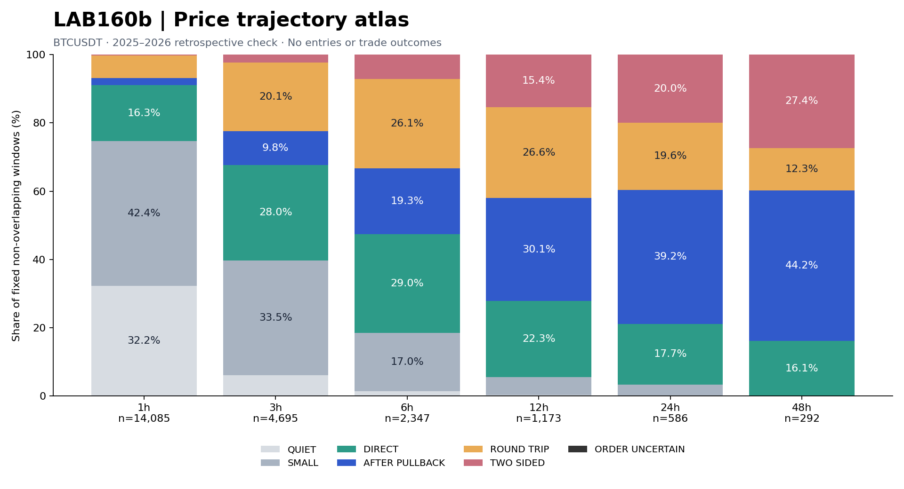
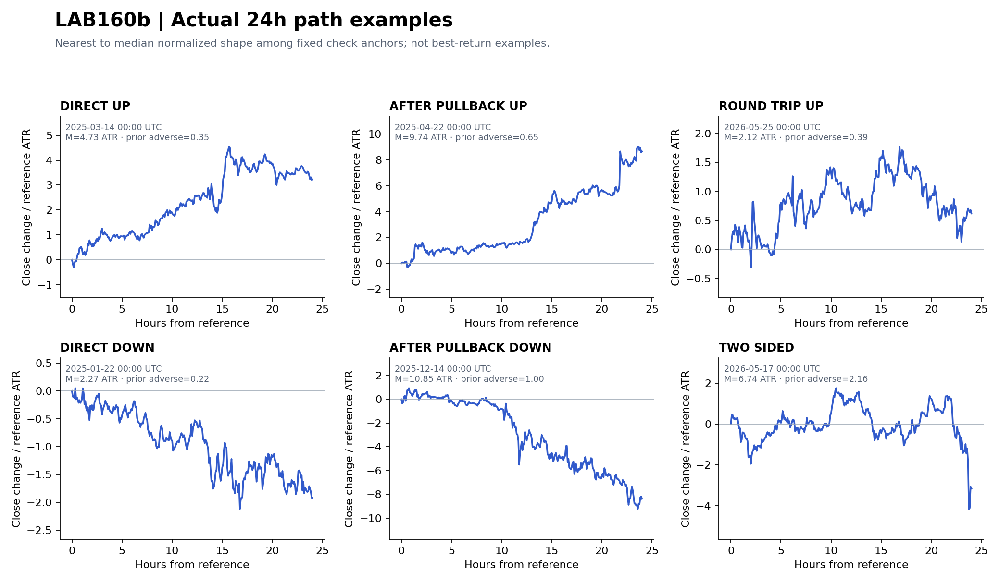

# LAB160b — PRICE FIRST TRAJECTORY × CROWD × OI × PROFILE STATE ATLAS

Завершено 2026-10-10. Дослідження BTCUSDT, **589 794 послідовних M5 моментів**, 2021-01-01 — 2026-08-10 21:25 UTC. Це повний атлас шести горизонтів, а не 6h-модель «2 ATR раніше за 1 ATR». Спочатку описано майбутні цінові шляхи; потім додано відомі на момент спостереження стани Crowd × OI × Profile. Входи, SL/TP, P/L і витрати тут не моделюються.

## Основний результат

1. На 24h у ретроспективній перевірці **39,2%** неперекривних вікон — збережений напрямок після відхилення проти нього ≥0,5 ATR; прямі — **17,7%**. На 48h: 44,2% і 16,1%. Отже, атлас має зберігати початково несприятливі шляхи, які пізніше формують великий рух.
2. На 24h є **107 неперекривних вікон перевірки** з рухом ≥3 ATR після початкового несприятливого відхилення ≥1 ATR. Медіана руху на всіх відповідних M5-вікнах — **5,41 ATR**, попереднього відхилення — **1,77 ATR**. Це ціна від умовної точки відліку, не доступний прибуток.
3. Із **125** комбінацій, відібраних лише за 2021–2024, **24** мають ≥30 неперекривних check-спостережень і ≥10 тижнів. 21 з них зберігають позитивну різницю проти загальної частоти класу, 14 — проти того самого Trend × Crowd × OI без профілю. Це описова перевірка, не статистично підтверджений edge.
4. Серед цих 24 лише **5** стосуються збережених спрямованих рухів; профіль додає позитивну різницю лише в **1**. Більшість підтриманих профільних асоціацій описують затихання або повернення ціни. Загальне правило «послабити Z, а профілем компенсувати якість» **не підтверджене**.
5. На 12/24/48h жодна відібрана п'ятивимірна комбінація не має 30 check-якорів. Це брак підтримки для деталізації станів, а не доказ відсутності довгого руху.

## Карта форм ціни



| Горизонт, h | Прямі, % | Після відхилення, % | Повернення, % | Двосторонні, % |
| --- | --- | --- | --- | --- |
| 1 | 16.3 | 2.1 | 6.7 | 0.3 |
| 3 | 28.0 | 9.8 | 20.1 | 2.3 |
| 6 | 29.0 | 19.3 | 26.1 | 7.2 |
| 12 | 22.3 | 30.1 | 26.6 | 15.4 |
| 24 | 17.7 | 39.2 | 19.6 | 20.0 |
| 48 | 16.1 | 44.2 | 12.3 | 27.4 |

Частки — 2025–2026, фіксовані неперекривні вікна; UP і DOWN об'єднано. Решта — QUIET/SMALL та невизначений внутрішньосвічковий порядок. Вікна різних горизонтів не можна складати в загальну кількість подій; навіть неперекривність не усуває ринкову автокореляцію.

- **QUIET:** максимум відхилення <0,5 ATR. **SMALL:** 0,5–1 ATR.
- **TWO_SIDED:** обидва боки ≥1 ATR, закриття зберігає <50% домінантного відхилення.
- **ROUND_TRIP:** решта рухів ≥1 ATR, які не зберегли ≥50% у домінантному напрямку.
- **DIRECT:** рух ≥1 ATR зі збереженням ≥50%; протилежне відхилення від початкової ціни перед головним екстремумом <0,5 ATR. Це не означає монотонний шлях або відсутність внутрішніх відкатів.
- **AFTER_PULLBACK:** той самий збережений рух, але перед головним екстремумом ціна відхилялася проти напрямку ≥0,5 ATR. Назва позначає initial adverse excursion, не конкретний entry setup.
- **ORDER_UNCERTAIN:** класифікація залежить від невідомого порядку high/low всередині екстремальної M5 свічки.

ATR = останній повністю закритий H1 SMA14 true range, зафіксований у момент відліку. Це не ATR поточного горизонту і не Wilder ATR. Future починається з наступної M5. Окремо збережені кінцева зміна, UP/DOWN excursion, час екстремумів, adverse-before-peak lower/upper, recovery time, retention, ефективність close-шляху, максимальні close drawdown/runup і 16 точок шляху. Повний high-low span = U+D. Continuation/reversal визначено окремо щодо відомого past6h руху ±0,5 ATR.



Це реальні close-шляхи механічно вибраних представників, найближчих до медіанної нормованої форми, не найприбутковіші приклади. High/low екстремуми можуть виходити за лінію close.

## Великі рухи після несприятливого початку

Фільтр лише для опису підмножини: домінантний рух ≥3 ATR, adverse до нього ≥1 ATR, термінальне збереження ≥50%. Він не використовується як вхід чи predictor.

| h | M5-вікон | % усіх M5 | Неперекривних | Медіана руху ATR | Медіана відхилення ATR |
| --- | --- | --- | --- | --- | --- |
| 1 | 84 | 0.05 | 8 | 3.62 | 1.17 |
| 3 | 1273 | 0.75 | 36 | 3.98 | 1.41 |
| 6 | 4878 | 2.89 | 73 | 4.28 | 1.46 |
| 12 | 13899 | 8.23 | 106 | 4.67 | 1.56 |
| 24 | 30861 | 18.29 | 107 | 5.41 | 1.77 |
| 48 | 46926 | 27.86 | 79 | 6.98 | 2.06 |

Це саме клас шляхів «спочатку −1,2 ATR, потім +5 ATR», який бар'єрне змагання могло класифікувати як невдалий до того, як рух розвинувся. Тут такі шляхи збережено; чи є доступний вхід після початкового відхилення — окреме питання LAB162.

## Стан перед рухом: що відтворилося

Підтримані спрямовані комбінації; усі probability-колонки нижче у %. `check_parent_prob` — та сама past6h trend × signed crowd × OI quantity4h без shape/location. `check_anchor_n` — кількість фіксованих неперекривних спостережень стану. Імовірності пораховані на всіх M5; додаткові anchor probabilities і тижневі bootstrap CI є в shortlist CSV.

| horizon_h | path_class | trend | crowd_state | oi_state | shape | location | train_prob | val_prob | check_prob | check_parent_prob | check_anchor_n |
| --- | --- | --- | --- | --- | --- | --- | --- | --- | --- | --- | --- |
| 1 | DIRECT_UP | UP | NEG | RISING | D | ABOVE | 13.71 | 13.21 | 9.2 | 9.78 | 525 |
| 1 | DIRECT_DOWN | UP | NEG | RISING | b | INSIDE | 10.69 | 13.05 | 5.29 | 7.82 | 34 |
| 1 | DIRECT_DOWN | DOWN | POS | RISING | D | INSIDE | 11.72 | 12.25 | 11.31 | 12.15 | 188 |
| 1 | DIRECT_DOWN | DOWN | POS | RISING | b | INSIDE | 10.95 | 16.29 | 10.41 | 12.15 | 89 |
| 3 | DIRECT_DOWN | UP | MID | STABLE | D | ABOVE | 18.91 | 18.26 | 17.47 | 14.31 | 31 |

Найбільш релевантний кандидат для слабкого crowd: **3h DIRECT_DOWN, past6h UP, |Z|<1, OI quantity стабільний ±0,35%, D-profile, ціна вище value**. Частота класу: **18,91% → 18,26% → 17,47%** (discovery → validation → check), у check matched parent **14,31%**, різниця **+3,17 п.п.** Усього **31** check-якір; тижневий 95% інтервал частоти **12,54–21,71%**. Це гіпотеза для LAB161, а не готовий SELL-сигнал. Інтервал частоти не є інтервалом різниці і не доводить значущість профілю.

Для інших чотирьох підтриманих спрямованих комбінацій додаткова різниця профілю від'ємна. Зміна частоти конкретного класу також не дорівнює зростанню очікуваного доходу. Не можна змішувати DIRECT_DOWN із усіма майбутніми SELL-рухами.

## Перетин зі старими raw-сигналами

Відновлено **506** raw-подій: A181, B3_HIGH44, EARLY_EPISODE147, R48_HIGH134. Межі оригінального replay — **2021–2024**. Shape-фільтр LAB159 виключає R48_HIGH з b-profile; це не повна емуляція live EA або портфеля.

Нижче неперекривні вікна з майбутнім збереженим рухом ≥3 ATR. «Є сигнал» означає raw-подію того самого напрямку від початку вікна до **відкриття** свічки головного екстремуму після shape-фільтра. Вхід до початку вікна не врахований; це обмеження метрики, а не «пропущений прибуток».

| h | Вікон ≥3 ATR | Є raw-сигнал | Частка, % |
| --- | --- | --- | --- |
| 1 | 491 | 11 | 2.24 |
| 3 | 777 | 41 | 5.28 |
| 6 | 877 | 61 | 6.96 |
| 12 | 791 | 61 | 7.71 |
| 24 | 539 | 67 | 12.43 |
| 48 | 345 | 70 | 20.29 |

Окремі uncovered-вікна з датами та станами збережено у CSV. Наявність багатьох рухів поза старими сигналами очікувана для рідкісної стратегії; сама собою не доводить можливість торгувати їх прибутково. Через scope старого replay не робимо висновків про пропуски ботом у 2025–2026.

## Перевірки й обмеження

- Рівномірна M5 сітка: 589 794 рядки, крок завжди 5 хв. Немає використання майбутнього класу у state predictors. Відсутність flow не виключає price-анатомію, лише conditional overlay.
- Discovery2021–2023, validation2024, retrospective check2025–2026; purge48h перед межами. Ця історія вже досліджувалася раніше, тому **не pristine OOS**.
- Shortlist: discovery N≥500, validation N≥150, ≥10 тижнів, подій ≥50/20, unconditional lift≥3 п.п. і позитивний trend-parent lift в обох періодах. Top3/class/h за мінімальним trend-parent lift. Check не використано для відбору; фільтр достатнього check-покриття не є підтвердженням edge.
- Bootstrap500 по тижнях; множинні порівняння не скориговані. Відмінність profile bucket може відображати інші зміни стану: це асоціація, **не причинний ефект профілю**.
- Volume Profile — проксі: обсяг M5 рівномірно розподілений у high–low, trailing24h, 40 bins, value70%. Це не tick volume-at-price. Flow availability = timestamp+5min — припущення, не виміряний publication lag.
- OI quantity — основний overlay, OI value — додатковий marginal. Пороги stable/falling/rising: ±0,35%; через right-inclusive cut точка −0,35% належить FALLING, +0,35% — STABLE.
- Синтетичні тести: delayed −1,2→+5, дзеркальні напрями, round-trip, intrabar ambiguity, missing/tail, межі горизонту. Для всіх шести горизонтів terminal/U/D зіставлено з LAB160, максимальна різниця <1e-10 ATR.
- У протоколі передбачали greedy episode examples; фінальна реалізація використовує лише незалежний від класу UTC-clock anchor sampling та механічні exemplars. Greedy episodes не потрібні для наведених підрахунків і не заявляються як виконані. Causal ознаки успадковано з LAB160; синтетичні тести цього lab перевіряють future-path engine.

## Відтворення і файли

Гілка базується на ResearchOS commit `368f56b32fd000ddb9dfc9132c29aec77d60fa53`. Джерела — release `btc`: `btc_5m.zip` і `BTCUSDT_flow_2021-01-2026-08.csv.zip`. SHA256 ціни `13188498f1f9eadc98550237590734bf65ec865ebe927458301d038e533858bd`; flow `b6c80084751305f394270c4b133abbf89a0264634924891251b13b33afbe5e0d`.

Спочатку відтворити LAB160 states його скриптом або взяти з попереднього повного пакета. Далі з кореня репозиторію:

```bash
python3 labs/LAB160B_PRICE_FIRST_TRAJECTORY_ATLAS_20261010/run_lab160b.py --price /path/btc_5m.zip --out results/LAB160B_20261010
python3 labs/LAB160B_PRICE_FIRST_TRAJECTORY_ATLAS_20261010/verify_lab160b.py
python3 labs/LAB160B_PRICE_FIRST_TRAJECTORY_ATLAS_20261010/legacy_overlap.py
python3 labs/LAB160B_PRICE_FIRST_TRAJECTORY_ATLAS_20261010/build_report.py
```

`legacy_overlap.py` використовує відновлений CSV сигналів і шість LAB160 labels для перевірки паритету. `recover_legacy_raw.py` відновлює CSV через незмінений LAB150; запускати з директорії, де лежать два вхідні ZIP з оригінальними назвами. Python dependencies: numpy, pandas, numba, pyarrow, matplotlib.

Повний пакет містить шість all-M5 parquet, states, всі state cells/marginals, shortlist з uncertainty, anatomy/magnitude/past-relation, приклади, legacy-overlap, код та графіки. Наявність code + input hashes дає відтворюваність; сирі release ZIP повторно не включені.

**Рішення:** перенести до LAB161 прогноз форми та напрямку з часовою перевіркою й укрупненими станами на довгих горизонтах. Окремо перевірити candidate 3h MID-crowd reversal і прогноз великих AFTER_PULLBACK шляхів. LAB162 визначить доступний вхід, LAB163 — net expectancy, costs і portfolio. LAB160b не є підставою змінювати production gate.
