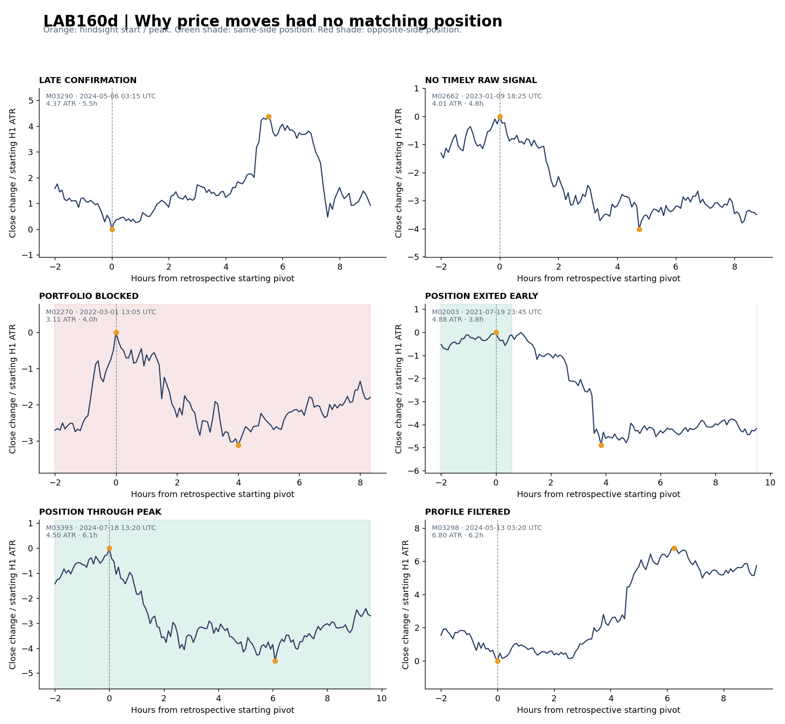

# LAB160d — MISSED PRICE MOVE AUDIT

Виконано 2026-10-10. BTCUSDT, **2021–2024**, baseline **LAB159 R48_NOT_b / OLD_PROFILE**, stress7,5bps, risk0,25%, оригінальні execution та пріоритети LAB155. Вхідні дані та правила не змінено для покращення результату.

## Відповідь: скільки рухів залишається поза ботом

У базовому визначенні окремої хвилі **≥3 H1 ATR**, із підтвердженням розвороту1 ATR, знайдено **1863 хвилі**. Це приблизно38,8 на місяць, але вони визначені ретроспективно і не є готовими торговими можливостями.

- **1706 / 1863 = 91,6%** не мали відкритої позиції в напрямку руху протягом хвилі.
- **157 / 1863 = 8,4%** мали таку позицію; у65 хвилях була позиція, відкрита раніше початку хвилі.
- **149 / 1863 = 8,0%** мали позитивний net-R внесок однойменних позицій на момент піку;8 хвиль мали позицію, але цей внесок був непозитивним.
- **138** хвиль — позиція залишалася відкритою до піку; **19** — закрилася раніше.
- Серед157 хвиль із позицією медіана найкращого single-trade gross захоплення ціни — **50%**. Це опис ціни з урахуванням partial TP, не50% усіх прибутків і не частка доходу рахунку.
- На хвилі без однойменної позиції припадає **90,4% сумарної ATR-нормованої амплітуди** цієї вибірки. Це вага цінових рухів, не втрачений P/L.

Основна прогалина цього бота — **утворення своєчасного сигналу для інших класів руху**. Скасування ліміту позицій або зміна виходів не усуває відсутність сигналів у більшості хвиль.

## Чому це не ті самі87,6%, що раніше

Старе число87,6% означало «немає нового raw-сигналу в добовому вікні до піку». Воно не враховувало вже відкриту позицію. Для тих самих539 добових вікон:

-67 мали новий raw-сигнал після shape-фільтра;
-87 мали позицію у напрямку руху, включно з відкритою раніше;
-**452 / 539 = 83,9%** залишилися без такої позиції;
-69 мали позитивний directional net-R внесок до консервативної межі вимірювання.

Для годинних вікон і окремих хвиль різні знаменники; їх не складаємо і не називаємо одним універсальним відсотком.

| Визначення руху | N | Новий raw-сигнал, % | Позиція в напрямку, % | Позитивний внесок у напрямку, % | Без позиції в напрямку, % |
| --- | --- | --- | --- | --- | --- |
| CLOCK_24H | 539 | 12.43 | 16.14 | 12.8 | 83.86 |
| CLOCK_48H | 345 | 20.29 | 21.16 | 15.65 | 78.84 |
| CLOCK_6H | 877 | 6.96 | 10.72 | 9.58 | 89.28 |
| LEG_REV1ATR | 1863 | 5.15 | 8.43 | 8.0 | 91.57 |
| LEG_REV2ATR | 1620 | 8.15 | 9.14 | 8.15 | 90.86 |

`LEG_REV2ATR` — заздалегідь визначена чутливість до ширшого розвороту. Частка без позиції **90,9%** проти91,6% у базовій сегментації. Отже, великий розрив покриття не зникає після цієї зміни визначення.

## Операційні причини для1863 окремих хвиль

Категорії взаємовиключні: спочатку перевіряється фактична позиція, потім своєчасний eligible/raw-сигнал, потім запізніле підтвердження. Відсотки — від усіх1863 хвиль.

| Причина / стан | Хвиль | % усіх хвиль |
| --- | --- | --- |
| Setup підтвердився після піку | 39 | 2.09 |
| Немає вчасного raw-сигналу | 1635 | 87.76 |
| Вчасний сигнал заблокований портфелем | 1 | 0.05 |
| Позиція була, але закрилася до піку | 19 | 1.02 |
| Позиція залишалася відкритою до піку | 138 | 7.41 |
| Вчасний raw-сигнал відсіяний профілем | 31 | 1.66 |

**1635 / 1706 = 95,8% хвиль без позиції** не мали вчасного raw-сигналу й не належать до окремо виділених profile/portfolio/late-confirmation випадків. «Немає raw-сигналу» не означає відсутність будь-яких змін Crowd/OI: базова подія могла бути, але повний набір умов setup не склався.

`PROFILE_FILTERED` означає, що у вікні був raw R48, який відсіяв NOT_b, але не було іншої однойменної позиції. Це **не доказ помилковості фільтра**: майбутній великий рух може виникнути після збиткового входу/стопа. LAB159 вимірює результати угод, а ця категорія — перетин із майбутнім рухом.

`LATE_CONFIRMATION` означає знайдений setup із початком до піку та підтвердженим входом після нього в заданому часовому контексті. Це не доказ, що можна безпечно торгувати до підтвердження.

## Які гейти не складалися

Відновлено **266895 оцінок кандидатів**, із них506 завершених raw-подій. Це не266895 незалежних setup: active-Z перевіряється повторно по свічках. Перед кожною хвилею без позиції перевірено кандидатів того самого напрямку від12h до старту й до піку; використовуються лише оцінки, вже відомі до межі піку.

Найчастіші **супутні** невиконані умови:

| gate | moves | denominator_without_position |
| --- | --- | --- |
| A:EXTENSION | 1602 | 1706 |
| EARLY_EPISODE:EXTENSION | 1588 | 1706 |
| EARLY_EPISODE:OI | 1554 | 1706 |
| A:OI | 1511 | 1706 |
| EARLY_EPISODE:PHASE | 1333 | 1706 |
| A:PHASE | 1315 | 1706 |
| B3_HIGH:H4_TREND_OR_AGE | 1043 | 1706 |
| EARLY_EPISODE:H4_TREND | 1042 | 1706 |
| A:H4_TREND | 964 | 1706 |
| B3_HIGH:TERMINAL_TWO_STEP | 559 | 1706 |
| R48_HIGH:COOLDOWN | 510 | 1706 |
| B3_HIGH:Z_STRENGTH | 445 | 1706 |
| B3_HIGH:OI | 365 | 1706 |
| R48_HIGH:OI | 339 | 1706 |

Ці числа **перекриваються**. Наприклад, біля одного руху могли бути різні кандидати з недостатнім extension, OI та невідповідною фазою. Не можна сказати, що зняття extension-гейта автоматично поверне1599 хвиль: інші умови й подальше підтвердження можуть залишитися невиконаними.

Окремо виділено випадки, коли у конкретної оцінки був лише один невиконаний поточний gate; це ближче до setup, але наступне SWING3/reclaim ще не гарантоване:

| engine | single_failed_gate | moves |
| --- | --- | --- |
| B3_HIGH | H4_TREND_OR_AGE | 1043 |
| R48_HIGH | COOLDOWN | 510 |
| B3_HIGH | ATTACK_DEPTH | 281 |
| EARLY_EPISODE | EXTENSION | 234 |
| B3_HIGH | TERMINAL_TWO_STEP | 231 |
| R48_HIGH | ACCEPT_4_OF_6 | 227 |
| A | EXTENSION | 178 |
| R48_HIGH | OI | 140 |
| EARLY_EPISODE | OI | 64 |
| A | OI | 54 |
| B3_HIGH | Z_STRENGTH | 40 |
| EARLY_EPISODE | PHASE | 38 |
| R48_HIGH | ACCEPT_MARGIN | 38 |
| A | PHASE | 31 |
| EARLY_EPISODE | EPISODE_AGE | 28 |
| R48_HIGH | RETEST | 21 |
| B3_HIGH | OI | 9 |
| EARLY_EPISODE | H4_TREND | 3 |
| A | H4_TREND | 2 |

У72 хвилях без позиції взагалі не знайдено однойменного primitive-кандидата в цьому12h-контексті. Для решти наявність хоча б одного кандидата також не доводить прогностичного зв'язку з хвилею. Цей аудит локалізує обмеження механізму; він не вимірює причинний ефект скасування кожного гейта.

## Реальні приклади

Приклад для кожної категорії обрано механічно — найближчий до її медіанної амплітуди й тривалості, без відбору за прибутком.



| move_id | start | peak | side | amplitude_atr | category | best_single_trade_gross_capture_pct |
| --- | --- | --- | --- | --- | --- | --- |
| M03290 | 2024-05-06 03:15:00+00:00 | 2024-05-06 08:45:00+00:00 | 1 | 4.37 | Setup підтвердився після піку | 0.0 |
| M02662 | 2023-01-09 18:25:00+00:00 | 2023-01-09 23:10:00+00:00 | -1 | 4.01 | Немає вчасного raw-сигналу | 0.0 |
| M02270 | 2022-03-01 13:05:00+00:00 | 2022-03-01 17:05:00+00:00 | -1 | 3.11 | Вчасний сигнал заблокований портфелем | 0.0 |
| M02003 | 2021-07-19 23:45:00+00:00 | 2021-07-20 03:35:00+00:00 | -1 | 4.88 | Позиція була, але закрилася до піку | -4.9 |
| M03393 | 2024-07-18 13:20:00+00:00 | 2024-07-18 19:25:00+00:00 | -1 | 4.5 | Позиція залишалася відкритою до піку | 88.2 |
| M03298 | 2024-05-13 03:20:00+00:00 | 2024-05-13 09:35:00+00:00 | 1 | 6.8 | Вчасний raw-сигнал відсіяний профілем | 0.0 |

У таблиці `side=1` BUY, `side=-1` SELL. Нуль захоплення для хвиль без позиції означає відсутність експозиції в напрямку, а не розрахований збиток від відмови торгувати. Червоне тло на графіку показує позицію проти напрямку хвилі, зелене — у напрямку.

## Стабільність за роками

| Рік | Хвиль | Із позицією в напрямку | Без позиції, % |
| --- | --- | --- | --- |
| 2021 | 437 | 46 | 89.47 |
| 2022 | 451 | 30 | 93.35 |
| 2023 | 477 | 23 | 95.18 |
| 2024 | 498 | 58 | 88.35 |

Жоден із чотирьох років не має широкого покриття цих цінових хвиль. Одна угода може перетинати кілька хвиль, тому157 хвиль із позиціями не дорівнюють157 окремим угодам.

## Як визначено рух і захоплення

**Clock:** ті самі UTC-якорі6/24/48h, максимум U/D≥3 ATR, terminal утримує≥50% домінантного відхилення. Reference — поточний закритий M5 close, ATR — останній закритий H1 SMA14 TR. Для high/low піку порядок усередині M5 невідомий, тому cutoff для сигналів і P/L — відкриття свічки піку. Позиція, що виходить на свічці піку, мала б окрему ambiguous-категорію; у наведеній вибірці таких випадків немає.

**Leg:** чергування close-півотів; новий розворот підтверджується відхиленням≥1 ATR від поточного екстремуму. ATR для підтвердження береться в екстремумі, для нормування амплітуди — у стартовому півоті. Початковий стан сіється першою валідною close-точкою періоду; наступні півоти визначаються розворотами. Враховуються завершені хвилі≥3 ATR; остання непідтверджена відкинута. Внутрішні часові інтервали не перекриваються. Півоти відомі тільки ретроспективно, **вхід у півот не симулюється**. Вхід точно на close піку вважається запізнілим.

**Захоплення:** для кожної фактичної однойменної угоди виміряна зміна її MTM від старту хвилі до cutoff, включно з partial TP та фактичним виходом. Уже відкриті позиції оцінюються від mark на старті; витрати повторно не списуються. Для нової позиції витрати списуються у момент входу. Виходи та partial за OHLC-bar припускаються відомими на close цієї свічки.

`best_single_trade_gross_capture_pct` = найбільший gross price-point внесок однієї угоди в цьому інтервалі / амплітуда хвилі. Це не net return: різні угоди мають різний ATR, можуть перекриватися, а ціни open/stop можуть бути кращими за close-півот. Тому значення не обрізається; у хвиль із позицією діапазон **−26,2%…113,0%**. Показник не можна віднімати від100% і називати результат «доступним втраченим прибутком».

`net_r_during_move` — сума внесків однойменних позицій, включно з нереалізованим результатом на піку. У повному CSV окремо є протилежні позиції (`opposite_net_r_during_move`) та сума обох напрямків (`all_sides_net_r_during_move`). Основна метрика покриття стосується саме напрямку руху, а не будь-якої відкритої угоди.

## Перевірки та межі висновку

- Відновлені pass-події точно збігаються з оригінальними мультимножинами: A181, B3_HIGH44, R48_HIGH134, EARLY_EPISODE147.
- Відновлено всі251 фактичні угоди OLD_PROFILE; net R збігається з LAB160c з точністю<1e-9. Часткові виходи й portfolio reject reasons записані окремо.
- Відтворено попереднє raw-покриття:61/877,67/539,70/345 для6/24/48h.
- Синтетичні тести перевірили pivot symmetry/nonoverlap, partial MTM, carried-position MTM та одноразове списання витрат. Таблиці причин і зв'язків узгоджені з кожною хвилею.
- Підготовка gate-даних, availability OI, видалення пропущених рядків і execution припущення успадковані від старого replay. Price-рухи рахуються на окремій регулярній price-only сітці. Це не нова перевірка tick fills чи publication lag.
- 2021–2024 вже досліджувалися. Це development-аудит, не pristine OOS. При іншому визначенні руху відсотки зміняться; sensitivity2ATR показана, але не охоплює всі можливі визначення.
- Немає оцінки oracle P/L, який бот міг би гарантовано заробити на всіх хвилях. Рух, видимий заднім числом, не тотожний прогнозованій можливості.

## Що це означає для наступного дослідження

Потрібно розширювати **класи розпізнаваних подій**, а не очікувати великого ефекту лише від concurrency або довшого утримання. Зокрема, дослідити, які price/Crowd/OI зміни повторюються перед непокритими хвилями й відрізняють їх від схожих станів без руху. Пропущені хвилі тут — labels для такого дослідження; обов'язковий контроль — усі аналогічні моменти, де сильного руху не було.

Саме такого прогнозного порівняння аудит не замінює. LAB160c уже показав, що просте послаблення Z може додавати збиткові угоди. Потрібен наступний тест умовної ймовірності й сили руху на всій вибірці, а потім transfer у доступний entry. Production не змінено.

## Відтворення та файли

Джерела: `btc_5m.zip`, SHA25613188498f1f9eadc98550237590734bf65ec865ebe927458301d038e533858bd; flow ZIP SHA256b6c80084751305f394270c4b133abbf89a0264634924891251b13b33afbe5e0d. Ті самі release `btc` і parent LAB160c.

З repo root, два ZIP у сусідньому `data/` або через `LAB160C_DATA`:

```bash
python3 labs/LAB160D_MISSED_MOVE_AUDIT_20261010/run_audit.py
python3 labs/LAB160D_MISSED_MOVE_AUDIT_20261010/enrich_audit.py
python3 labs/LAB160D_MISSED_MOVE_AUDIT_20261010/verify_audit.py
python3 labs/LAB160D_MISSED_MOVE_AUDIT_20261010/build_report.py
```

Dependencies: numpy,pandas,matplotlib. Пакет містить код, gate journal, price moves, поелементний аудит, links до фактичних угод, portfolio decisions, summaries, приклади й validation. Проміжна20MB price-tape pickle та source ZIP не включені; price tape відновлює `run_audit.py` для побудови графіка.
