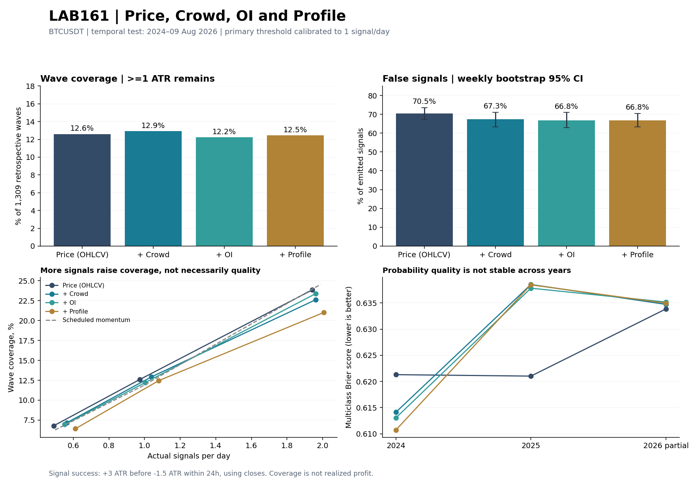

# LAB161 — PRICE → CROWD → OI → PROFILE

Дата: 2026-10-10. Відтворюване дослідження BTCUSDT, parent LAB160d `dbc99709494b47d38464d7e450fffd880a0debb6`. Production не змінено.

## Висновок

**Просте додавання Crowd, OI і profile до моделі ціни не дало стійкого розширення покриття рухів.** При приблизно одному сигналі на день моделі розпізнають12–13% окремих хвиль; близько67–70% сигналів не виконують зафіксовану цінову умову. Додаткові ознаки не усунули проблему слабкої прогностичної якості в цьому експерименті.

Crowd знижує спостережувану частку хибних сигналів із70,49% до67,31%, але paired weekly95% CI різниці **−7,25…+1,13 п.п.** включає нуль. Покращення не називаємо доведеним. OI додає лише−0,54п.п. хибних; profile змінює показник на+0,06п.п. Обидва інтервали також включають нуль.

Profile не показує підтвердженого приросту покриття чи точності понад PRICE+CROWD+OI. Це не скасовує LAB159: там досліджувався фільтр уже відібраних R48-угод; тут — прогноз широкої вибірки ринку.



## Основне порівняння

Тести2024,2025 та2026 до9 серпня21:25UTC; **1309 окремих хвиль**, із них1306 мають хоча б одну спільну доступну точку прогнозу в дозволеному інтервалі. Це інший період і суворіша метрика, ніж91,6% у LAB160d. Безпосередньо віднімати ці відсотки один від одного не можна.

Калібрування на попередньому році націлене на1 сигнал/день; фактична частота в тесті показана окремо і не є абсолютно однаковою. Немає вибору порогів за результатом тестового року.

| Модель | Сигналів | На день | Хибні, % | Покрито ≥1 ATR, % | ≥2 ATR, % | ≥3 ATR, % | Залишок ATR* |
| --- | --- | --- | --- | --- | --- | --- | --- |
| PRICE | 925 | 0.97 | 70.49 | 12.61 | 8.86 | 5.04 | 2.71 |
| PRICE_CROWD | 985 | 1.04 | 67.31 | 12.91 | 9.78 | 5.58 | 2.77 |
| PRICE_CROWD_OI | 954 | 1.00 | 66.77 | 12.22 | 8.86 | 5.73 | 2.86 |
| PRICE_CROWD_OI_PROFILE | 1025 | 1.08 | 66.83 | 12.45 | 9.09 | 5.35 | 2.75 |

*Залишок ATR — **медіана лише серед розпізнаних хвиль**: від close першого відповідного сигналу до ретроспективного піку, у ATR на момент сигналу. Це не середній результат усіх сигналів і не зароблений R. Медіанний час до піку у цих хвилях — приблизно2,8–3,0години. У повної моделі медіанна залишкова частка амплітуди —62,2% серед розпізнаних хвиль.

За суворішої умови, що сигнал також успішний за3-before-1.5, coverage у повної моделі — **9,24%**, проти8,02% у PRICE. Це спільна вимога до хвилі та майбутньої траєкторії сигналу, не торговий P/L.

## Що саме означає хибний сигнал

На закритті M5 модель обирає BUY або SELL. Успіх: протягом наступних24h ціна **закриття** досягла+3 ATR у вибраному напрямку раніше, ніж−1,5 ATR. ATR зафіксований на сигналі; intrabar high/low тут не визначає послідовність. Невиконання цієї умови — хибний сигнал для конкретної дослідницької цілі, не обов'язково збиткова угода за іншими exits.

Для повної моделі на основній частоті:
-33,17%: +3 ATR до зустрічних1,5 ATR;
-9,27%: +3 ATR усе-таки досягнуто, але спочатку була несприятлива траєкторія;
-57,56%: +3 ATR не досягнуто за24h.

Таким чином, слабкість не пояснюється тільки надто раннім стопом у нашому визначенні: **більше половини сигналів повної моделі взагалі не отримують потрібного3ATR руху у свій бік за24h**. Це не доводить непридатності інших горизонтів/амплітуд.

## Стабільність за роками

| year | model | signals_per_day | false_pct | coverage1_pct | remaining_atr_median |
| --- | --- | --- | --- | --- | --- |
| 2024 | PRICE | 0.69 | 67.73 | 9.07 | 2.71 |
| 2024 | PRICE_CROWD | 0.71 | 67.57 | 9.27 | 2.71 |
| 2024 | PRICE_CROWD_OI | 0.79 | 64.58 | 9.68 | 2.94 |
| 2024 | PRICE_CROWD_OI_PROFILE | 0.84 | 65.80 | 10.69 | 2.75 |
| 2025 | PRICE | 1.34 | 71.37 | 16.22 | 2.76 |
| 2025 | PRICE_CROWD | 1.61 | 67.80 | 19.31 | 2.77 |
| 2025 | PRICE_CROWD_OI | 1.46 | 68.74 | 17.37 | 2.74 |
| 2025 | PRICE_CROWD_OI_PROFILE | 1.55 | 67.61 | 16.41 | 2.72 |
| 2026 | PRICE | 0.84 | 71.89 | 12.20 | 2.67 |
| 2026 | PRICE_CROWD | 0.63 | 64.75 | 7.80 | 3.11 |
| 2026 | PRICE_CROWD_OI | 0.61 | 63.70 | 7.46 | 2.90 |
| 2026 | PRICE_CROWD_OI_PROFILE | 0.69 | 66.01 | 8.47 | 3.33 |

2024: повна модель покриває10,69%, ціна9,07%, але повна модель також подає більше сигналів. 2025: Crowd піднімає coverage до19,31%, частково на тлі частоти1,61/день проти1,34у PRICE. 2026: повна модель8,47% проти12,20% у PRICE і також рідше сигналізує. Тому ці різниці не є чистим порівнянням за однакової кількості сигналів. Саме для цього паралельно вимірюється якість імовірностей на всіх спільних M5-рядках.

## Якість прогнозів на всій M5-сітці

Brier — сума квадратів помилки трьох імовірностей NONE/UP/DOWN; менше краще. На відміну від coverage за порогом, цей показник не залежить від кількості відібраних сигналів. Порівняння парне,95% інтервали — bootstrap календарних тижнів,1000перевибірок. Це враховує кластеризацію, але не робить багаторічний ринок стаціонарним і не усуває весь ризик багаторазових порівнянь.

| previous | model | delta_brier | ci_low | ci_high |
| --- | --- | --- | --- | --- |
| BASE_RATE | PRICE | -0.003940 | -0.008893 | +0.001320 |
| PRICE | PRICE_CROWD | +0.004194 | -0.001412 | +0.010942 |
| PRICE_CROWD | PRICE_CROWD_OI | -0.000578 | -0.002876 | +0.001827 |
| PRICE_CROWD_OI | PRICE_CROWD_OI_PROFILE | -0.000688 | -0.003409 | +0.001890 |

Негативна delta — покращення. **Жоден сукупний приріст не має інтервалу цілком нижче нуля.** Додавання Crowd у2024 покращує Brier на−0,00717 (CI−0,01368…−0,00093), а у2025 погіршує на+0,01750 (CI+0,00542…+0,02985). Поліпшення precision відібраного хвоста і погіршення ймовірностей по всій вибірці можуть співіснувати; це різні метрики. Ймовірності моделі не проходили окремого probability calibration, тому їх не слід показувати на стрілках як доведену ймовірність успіху.

Повні ALL_M5 та DAILY_ANCHOR Brier/logloss/AP/base-rate таблиці — у `LAB161_probability_metrics.csv`.

## Невизначеність додаткової користі

Основна частота, paired weekly bootstrap; хибні оцінюються як різниця часток у двох потоках сигналів на тих самих перевибраних тижнях, coverage — на тих самих хвилях. Пороги незмінні, фактична частота може різнитися.

| previous | model | delta_false_pp | ci_low | ci_high |
| --- | --- | --- | --- | --- |
| PRICE | PRICE_CROWD | -3.18 | -7.25 | 1.13 |
| PRICE_CROWD | PRICE_CROWD_OI | -0.54 | -3.15 | 2.00 |
| PRICE_CROWD_OI | PRICE_CROWD_OI_PROFILE | 0.06 | -2.39 | 2.51 |

| previous | model | delta_coverage_pp | ci_low | ci_high |
| --- | --- | --- | --- | --- |
| PRICE | PRICE_CROWD | 0.31 | -1.81 | 2.44 |
| PRICE_CROWD | PRICE_CROWD_OI | -0.69 | -2.20 | 0.63 |
| PRICE_CROWD_OI | PRICE_CROWD_OI_PROFILE | 0.23 | -1.36 | 1.90 |

Усі наведені інтервали перетинають нуль. Немає підстав оголосити переможцем повну модель або автоматично включати ці ознаки у production.

## Чи допомагає більша частота

Наперед визначена чутливість: калібрування на2 сигнали/день:

| model | signals_per_day | false_pct | coverage1_pct | clean_coverage1_pct |
| --- | --- | --- | --- | --- |
| PRICE | 1.94 | 71.48 | 23.83 | 14.97 |
| PRICE_CROWD | 1.96 | 67.47 | 22.61 | 15.97 |
| PRICE_CROWD_OI | 1.96 | 68.76 | 23.38 | 15.51 |
| PRICE_CROWD_OI_PROFILE | 2.01 | 68.57 | 21.01 | 14.59 |

Coverage зростає до21–24%, але частка хибних залишається67–71%. Це переважно збільшення кількості спроб, а не продемонстрований якісний стрибок. Повна модель при2,01сигнала/день покриває21,01% хвиль; PRICE при1,94 —23,83%.

Простий контроль за розкладом із напрямком trailing6h momentum при приблизно1/день покриває11,84%, але має76,59% хибних. При2/день він покриває24,52% і має73,99% хибних. Це показує, чому високий coverage без одночасного контролю помилок недостатній. Контроль за розкладом не підібраний за результатом і не є рівночастотним випадковим тестом.

## Чутливість до визначення хвилі

Для ширшого підтвердження розвороту2 ATR —1163 хвилі. Інтервали хвиль стають довшими, тож новому сигналу легше потрапити всередину. Основна частота:

| model | waves | covered1 | covered2 | covered3 | coverage1_pct |
| --- | --- | --- | --- | --- | --- |
| PRICE | 1163 | 269 | 202 | 142 | 23.13 |
| PRICE_CROWD | 1163 | 254 | 203 | 137 | 21.84 |
| PRICE_CROWD_OI | 1163 | 241 | 196 | 146 | 20.72 |
| PRICE_CROWD_OI_PROFILE | 1163 | 244 | 192 | 144 | 20.98 |
| SCHEDULE_MOMENTUM | 1163 | 360 | 225 | 136 | 30.95 |

Покриття вище, але профіль знову не перевершує PRICE. Не змішуємо ці знаменники з1ATR-сегментацією.

## Порівняння зі старими сигналами в одному періоді

Лише2024, однаковий новий критерій: сигнал усередині хвилі, строго до піку, пік у межах24h, щонайменше1ATRзалишку. Старі raw-події після NOT_b дедупліковані за часом і напрямком; використано лише спільні доступні рядки. Це не зіставлення251 фактичної угоди з новими симульованими угодами.

| model | signals | signals_per_day | false_pct | coverage1_pct |
| --- | --- | --- | --- | --- |
| LEGACY_RAW_PROFILE | 90 | 0.25 | 63.33 | 5.04 |
| PRICE | 251 | 0.69 | 67.73 | 9.07 |
| PRICE_CROWD | 259 | 0.71 | 67.57 | 9.27 |
| PRICE_CROWD_OI | 288 | 0.79 | 64.58 | 9.68 |
| PRICE_CROWD_OI_PROFILE | 307 | 0.84 | 65.80 | 10.69 |
| SCHEDULE_MOMENTUM | 360 | 0.99 | 75.56 | 9.27 |

У старих90raw-сигналів coverage5,04% проти10,69% у повної моделі з307сигналами. Отже, кількість сигналів зросла значно сильніше, ніж покриття. Старий raw success за новим label36,67% має широку невизначеність; це не його історичний win rate/PF.

## Що перевірено і чого висновок не доводить

-PRICE:18ознак OHLCV — минулі зміни ціни, range location/width, EMA distance, ATR%, реалізована мінливість і агрегований volume ratio. Crowd:+6ознак long/short ratio,6hZ та їх зміни. OI:+4зміни кількості контрактів за30m/1h/4h/24h. Profile:+11ознак shape, відстань доPOC/VAL/VAH, щільність, ширина value, міграціяPOC. Повний список уJSON.
-Одна фіксована архітектура gradient boosting, без підбору гіперпараметрів за тестом. Навчання на кожній третій M5-точці (UTC15m), оцінювання всіх доступних M5. Хронологічні train/calibration/test,24hpurge; threshold калібрується лише на попередньому році. Сигнали мають спільний6hcooldown, без фільтра старих setup.
-589794рядків, 572920спільних повних спостережень у2021–2026; тести мають271671M5-рядок. OHLCV закінчується10серпня2026, хоча flow триває далі: майбутню ціну не домальовано. Покриття даних за роками збережене окремо.
-Profile реконструйований заM5OHLCV,24h/40bins. Це не tick volume-at-price. Flow зсувається на5хв: припущення доступності, не виміряний publication lag у live.
-Нуль future price gaps у price tape; пропущений flow не forward-fill. Ознаки доступні на закритті; causal-prefix тест пройдено. Synthetic label/barrier/cooldown/endpoint tests пройдено. Успадковані3483завершені хвилі двох визначень LAB160d відтворені точно.
-2021–2026 вже використовувалися для спорідненого пошуку. Це часові held-out прогнози в рамках LAB161, **не pristine project OOS**. Довірчі інтервали умовні на цей протокол і не враховують усі попередні спроби.
-Одна модель, один primary horizon і зафіксований набір ознак не доводять, що Crowd/OI/profile завжди марні. Вони показують, що ці конкретні causal summaries не забезпечили стійкого додаткового результату тут.
-Немає виконаних входів, SL/TP, витрат, PF, DD або прогнозу доходу. Close-barrier результат не замінює execution replay.

## Практичний висновок для дослідження

Попередній аудит локалізував вузьке покриття старих setup. LAB161 додав важливу перевірку: **зняти старі setup і просто об'єднати поточні price/Crowd/OI/profile-ознаки недостатньо для сильного загального детектора рухів**. Потрібно досліджувати форму події та розвиток стану у часі, окремо continuation/reversal, і вимагати приросту поза навчальним періодом. Це гіпотеза наступної роботи, не доведена причина і не вже виконане покращення. Поточний production залишено без змін.

## Відтворення

Input ZIP: release `btc` репозиторію chepigga/ResearchOS. SHA256 і версії в `LAB161_data_audit.json` та `LAB161_versions.json`. Файли помістити в сусідній до repo `data/` або встановити `LAB160C_DATA`. Встановлені numpy,pandas,numba,scikit-learn,joblib,matplotlib.

```bash
export OMP_NUM_THREADS=2
export OPENBLAS_NUM_THREADS=2
python3 labs/LAB161_PRICE_CROWD_OI_PROFILE_ABLATION_20261010/prepare.py
python3 labs/LAB161_PRICE_CROWD_OI_PROFILE_ABLATION_20261010/run_models.py
python3 labs/LAB161_PRICE_CROWD_OI_PROFILE_ABLATION_20261010/evaluate.py
python3 labs/LAB161_PRICE_CROWD_OI_PROFILE_ABLATION_20261010/uncertainty.py
python3 labs/LAB161_PRICE_CROWD_OI_PROFILE_ABLATION_20261010/verify.py
python3 labs/LAB161_PRICE_CROWD_OI_PROFILE_ABLATION_20261010/build_report.py
```

Archive містить код, протокол,12навчених моделей, усі emitted signals, поелементне зіставлення з хвилями, підсумки та перевірки. Великі відновлювані `LAB161_dataset.pkl` та повні M5predictionNPZ не включено; вони відновлюються першими двома командами. `evaluate.py` повторно відкидає старі legacy-рядки перед додаванням, тож повторне виконання не дублює їх.
