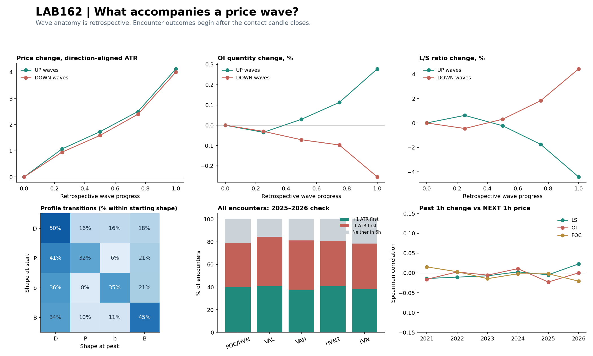
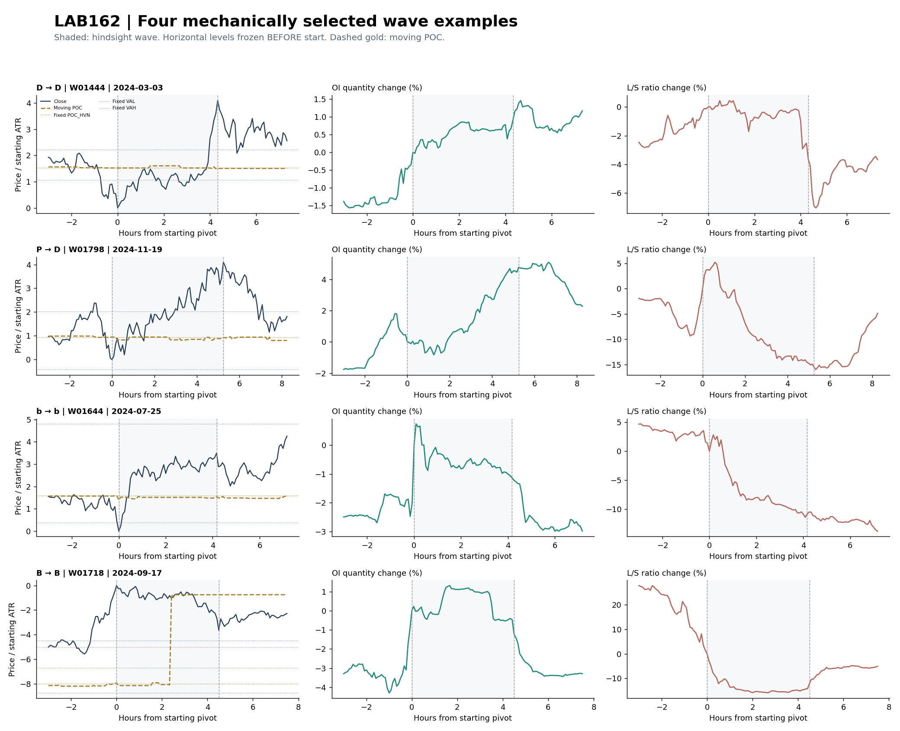

# LAB162 — PRICE WAVE × PROFILE TRANSITIONS × OI × CROWD

Виконано 2026-10-10. BTCUSDT, 2021–10 серпня 2026. Parent LAB161 `c254ca9e76e2103ba23de130edf4ded4c62a4bd5`. Production без змін.

## Відповідь

**Взаємозв'язки постфактум є, але проста універсальна схема «цей профіль/вузол штовхає або зупиняє ціну» не підтвердилася.** У значних висхідних хвилях L/S у медіані падає на4,42%, у низхідних зростає на4,43%. OI змінюється значно неоднорідніше. Це опис того, що відбулося всередині вже відібраних хвиль, а не доказ, що зміна L/S випереджала рух або спричинила його.

Дослідження включає **2680 хвиль** основного1ATR-визначення та2363 хвилі2ATR-чутливості,115984 вирівняні спостереження й43519 внутрішніх сегментів (два визначення не складаємо як незалежні рухи). Для незалежної від відбору хвиль перевірки — **19662 взаємодії з рівнями** після6h-purge,18781 унікальний час події. До purge19665 подій; у2024 видалено3 події з невалідним поточним OI.



## 1. Що відбувається всередині хвилі

| side | waves | oi_valid | oi_median_pct | ls_valid | ls_median_pct | poc_migration_median_atr |
| --- | --- | --- | --- | --- | --- | --- |
| -1 | 1351 | 1344 | -0.255 | 1332 | 4.432 | 0.009 |
| 1 | 1329 | 1322 | 0.278 | 1311 | -4.422 | 0.004 |

`side=1` — висхідна хвиля; `side=-1` — низхідна. OI — кількість контрактів, L/S — співвідношення кількості long/short-акаунтів, а не доларові позиції. Відсотки — медіана відносної зміни від стартового до кінцевого close-екстремуму. Кількість валідних flow-спостережень показана окремо.

Рух часто супроводжується зміною L/S проти напрямку ціни. Це сумісно з контртрендовою поведінкою вимірюваної групи акаунтів, але не ідентифікує конкретних покупців/продавців, ліквідації чи причину руху. OI в середньому не розрізняє «відкривали long» і «відкривали short»: кожен контракт має обидві сторони.

**POC зазвичай рухається набагато повільніше:** у60.7% хвиль його абсолютне переміщення від передстартового профілю до піку менше0,25 стартовогоATR. Для trailing24h-профілю на хвилях медіанної тривалості кілька годин це важлива практична межа: старий головний вузол не обов'язково пересувається разом із поточним імпульсом.

Форма профілю також часто змінюється всередині хвилі. Матриця нижче — кількості, без трактування як ймовірностей майбутнього руху; ми вже відібрали великі хвилі:

| shape_start | D | P | b | B |
| --- | --- | --- | --- | --- |
| D | 621 | 198 | 197 | 224 |
| P | 167 | 132 | 26 | 85 |
| b | 140 | 31 | 137 | 80 |
| B | 221 | 65 | 69 | 287 |

Траєкторії до старту та до/після піку збережено для−12/−6/−3/−1/0/+0,5/+1/+3/+6/+12годин, а також25/50/75% тривалості хвилі. Внутрішні імпульси/відкати виділені порогом0,5стартовогоATR; вони ретроспективні й не є готовими входами.

## 2. Чи зупиняються хвилі біля профілю

Для кожної хвилі зафіксовано профіль **за одну M5-свічку до її старту**. Окремо виміряно рівні з останньої свічки перед піком. «Близько» = не далі0,25ATR на момент піку; вимірювання за close, не за тінню.

| level | snapshot | valid_waves | near_peak_pct |
| --- | --- | --- | --- |
| POC_HVN | fixed | 2680 | 2.836 |
| POC_HVN | prior | 2680 | 1.716 |
| VAL | fixed | 2680 | 3.060 |
| VAL | prior | 2680 | 4.254 |
| VAH | fixed | 2680 | 3.060 |
| VAH | prior | 2680 | 3.918 |
| HVN2 | fixed | 1782 | 2.974 |
| HVN2 | prior | 1806 | 1.938 |
| LVN | fixed | 994 | 3.018 |
| LVN | prior | 1109 | 2.615 |

`fixed` — перед стартом; `prior` — перед піком. Усього лише11.1% хвиль завершують close-екстремум поблизу хоча б одного з п'яти зафіксованих рівнів. Це не означає, що обсяг не впливає на ринок: результат залежить від24h-вікна,40bins, порога0,25ATR, close-півотів і реконструкції обсягу. Це також не тест проти випадкового розташування рівнів. Проте вибрані рівні не дали простого пояснення більшості кінцевих екстремумів через сам факт близькості.

**Не можна назвати вузол причиною зупинки лише тому, що він сформувався в її районі.** Саме тому передстартовий профіль збережений окремо від поточного.

## 3. Що відбувається після всіх торкань рівнів

Події шукаються по всій M5-історії, навіть якщо великої хвилі потім немає. Рівень відомий із попередньої свічки. Ціна підходить із визначеного боку, high/low торкається смуги±0,1ATR. Подія стає відомою на close. Далі перевіряємо, який close-бар'єр від **цього close** досягнуто першим за6h: +1ATR у напрямку підходу або−1ATR проти нього. Якщо жоден — unresolved. Великі переміщення самої контактної свічки не зараховуються в майбутній результат.

Пізній CHECK:2025–доступний2026,5855 подій:

| level | n | pass_pct | reject_pct | unresolved_pct |
| --- | --- | --- | --- | --- |
| HVN2 | 1185 | 40.759 | 39.916 | 19.325 |
| LVN | 685 | 37.956 | 40.584 | 21.460 |
| POC_HVN | 1561 | 39.718 | 39.142 | 21.140 |
| VAH | 1230 | 37.886 | 43.171 | 18.943 |
| VAL | 1194 | 40.787 | 43.551 | 15.662 |

Це умовні частоти після контактів, не твердження, що рівень викликав реакцію. Один timestamp інколи стосується кількох рівнів; не трактуємо їх як незалежні спроби. HVN2/LVN відсутні там, де алгоритм не знайшов відповідного другого вузла/западини.

Видно обидва типи реакції біля кожного рівня. Наприклад, LVN не забезпечує універсальний прохід, а POC/HVN не забезпечує універсальний відскок. У повних таблицях відокремлено закриття за рівнем, повернення на бік підходу та close у зоні рівня.

## 4. Чи пояснюють реакцію форма + OI + Crowd

Порівняння зроблено з базою того самого рівня, типу закриття, напрямку підходу і попереднього6h-тренду. Додатково перевірено форму, OI4h, напрямок Z натовпу, перехід форми за попередню годину та спільну комбінацію.

- Знайдено3857 умовних комірок; PASS і REJECT дають7714 розглянутих перевірок.
- Лише **78 комірок** мають достатній наперед заданий обсяг: навчання≥100подій/20тижнів і2024≥30подій/10тижнів.
- Для сильного кандидата вимагали приріст≥10п.п. у2021–2023 та≥5п.п. у2024 над відповідною базою.
- **Жодна комірка не пройшла обидві вимоги.** Одна достатньо наповнена комірка досягла+10п.п. у discovery, але не повторила перевагу у validation. Відібраних кандидатів для фінальної перевірки —0.

Це не доводить відсутності будь-якого слабшого зв'язку. Вибірка сильно розріджується після розбиття на всі стани, а пороги10/5п.п. навмисно вимагають суттєвого ефекту. Повні результати, включно з меншими позитивними й негативними приростами, збережені. Пороги після перегляду результату не послаблювалися.

## 5. Описує минуле чи передбачає наступне

Додаткова описова перевірка, додана після розбору подій; вона не використовувалася для відбору кандидата. На фіксованих годинних точках порівняно зміну L/S, OI та POC за попередню годину зі зміною ціни за наступну годину. Наведено Spearman correlation:

| year | LS_change_1h | OI_change_1h | POC_change_1h |
| --- | --- | --- | --- |
| 2021 | -0.014 | -0.016 | 0.015 |
| 2022 | -0.011 | 0.002 | 0.003 |
| 2023 | -0.007 | -0.006 | -0.014 |
| 2024 | 0.003 | 0.011 | -0.002 |
| 2025 | -0.005 | -0.023 | -0.002 |
| 2026 | 0.023 | 0.000 | -0.021 |

У цих простих безумовних годинних зв'язках значення близькі до нуля. Це не суперечить помітній зміні L/S всередині відібраних великих хвиль: там є відбір за майбутнім рухом і змінна тривалість, тут — усі годинні моменти й фіксований горизонт. Нелінійні взаємодії та інші масштаби таким тестом не виключені.

## 6. Приклади на графіку

Для кожної початкової форми D/P/b/B взято хвилю2024, найближчу до медіан її групи за амплітудою та тривалістю, з тривалістю≤24h і валідними flow у кінцях. Відбір не залежить від краси пояснення або прибутковості. Тло — ретроспективна хвиля; горизонтальні рівні — перед стартом; золотий пунктир — поточний POC.



| move_id | start | peak | side | shape_start | shape_peak | amplitude_atr | duration_h |
| --- | --- | --- | --- | --- | --- | --- | --- |
| W01444 | 2024-03-03 08:10:00+00:00 | 2024-03-03 12:30:00+00:00 | 1 | D | D | 4.087 | 4.333 |
| W01798 | 2024-11-19 14:00:00+00:00 | 2024-11-19 19:15:00+00:00 | 1 | P | D | 4.096 | 5.250 |
| W01644 | 2024-07-25 14:10:00+00:00 | 2024-07-25 18:20:00+00:00 | 1 | b | b | 3.490 | 4.167 |
| W01718 | 2024-09-17 15:20:00+00:00 | 2024-09-17 19:50:00+00:00 | -1 | B | B | 3.655 | 4.500 |

## Визначення й обмеження

- Хвилі успадковані зLAB161/LAB160d: close-M5 екстремуми, розворот1ATR, амплітуда≥3ATR;2ATR sensitivity збережена окремо. Початок/пік відомі заднім числом. Контекст CONT/REV/FLAT визначається попереднім6h-рухом на старті; це не хвилі Елліотта і не повна розмітка ринкової структури.
- Profile:24h/40bins, рівномірний розподіл M5volume між high/low, не справжній tick footprint. POC/VAL/VAH перевірені на точну відповідністьLAB161.
- **B — нове структурне визначення:** два піки згладженого3bins-профілю, відстань≥6bins, другий≥70% головного, западина≤70% меншого піку. Для HVN2 достатньо50%; LVN потрібна виражена западина. Інакше P/b задаються верхньою/нижньою третиною POC та перевагою обсягу1,15; рештаD. СтарийDOUBLE збережено окремо й не прирівняно доB. Вторинні локальні піки шукаються у внутрішніх bins; крайові форми можуть бути класифіковані інакше.
- B займає приблизно28% валідних M5-профілів, старийDOUBLE близько8%; тому LAB159 gate не переносився на нову класифікацію без тесту.
-473 невалідні записи OI≤0 перетворені на missing для OI-траєкторій. Три контакти з таким OI вилучені. Missing flow не домальовано. Flow має успадковане припущення затримки5хв, не виміряний live publication lag.
- Навчання2021–2023, validation2024, check2025–2026;6h-purge на межах. Роки вже використовувалися у проекті: не pristineOOS. Пошук багатьох комбінацій потребує подальшого незалежного підтвердження.
- Зіставлення форми/OI/Crowd умовне на ціновий контекст контакту. Немає рандомізованого експерименту або повного набору учасників/ліквідацій/ліквідності, тому причинне «штовхає/зупиняє» не встановлено.
- Немає execution replay, costs, PF/DD або нового live-сигналу. Показники бар'єрів є описом ціни.

## Що отримали

LAB162 дає відтворювану анатомію: **як рухалися ціна, OI, L/S та профіль**, де були старі рівні, як проходили внутрішні імпульси/відкати й що відбувалося після контактів незалежно від появи великої хвилі. Помітна зміна всередині хвилі не перетворилася автоматично на сильний передвісник. Дані не виправдовують ні універсального правила по літері профілю, ні твердження, що ці ознаки взагалі марні.

## Відтворення

ПотрібенLAB161_dataset.pkl іLAB161_waves.csv (відновлюються кодомLAB161), а також оригінальний flowZIP у сусідньомуdata/ абоLAB160C_DATA. SHA256 джерел —LAB162_data_audit.json. Код працює зnumpy,pandas,numba,scipy,matplotlib.

```bash
python3 labs/LAB162_WAVE_PROFILE_FLOW_TRAJECTORIES_20261010/prepare.py
python3 labs/LAB162_WAVE_PROFILE_FLOW_TRAJECTORIES_20261010/events.py
python3 labs/LAB162_WAVE_PROFILE_FLOW_TRAJECTORIES_20261010/waves.py
python3 labs/LAB162_WAVE_PROFILE_FLOW_TRAJECTORIES_20261010/analyze.py
python3 labs/LAB162_WAVE_PROFILE_FLOW_TRAJECTORIES_20261010/lead_lag.py
python3 labs/LAB162_WAVE_PROFILE_FLOW_TRAJECTORIES_20261010/verify.py
python3 labs/LAB162_WAVE_PROFILE_FLOW_TRAJECTORIES_20261010/build_report.py
```

Архів містить повні encounters, wave trajectories, anatomy, internal legs, transitions, всі conditional cells, контрольні таблиці, графіки, протокол і код. Великий відновлюванийLAB162_tape.pkl не включено. Звіт та графіки не замінюють поелементні таблиці.
