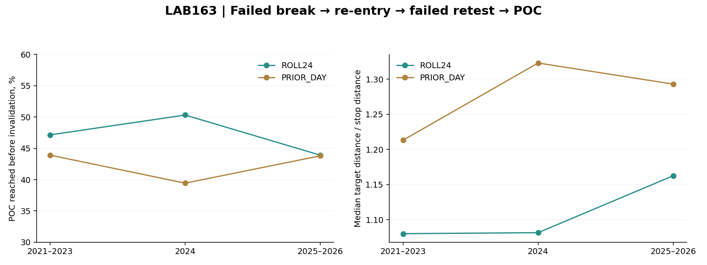
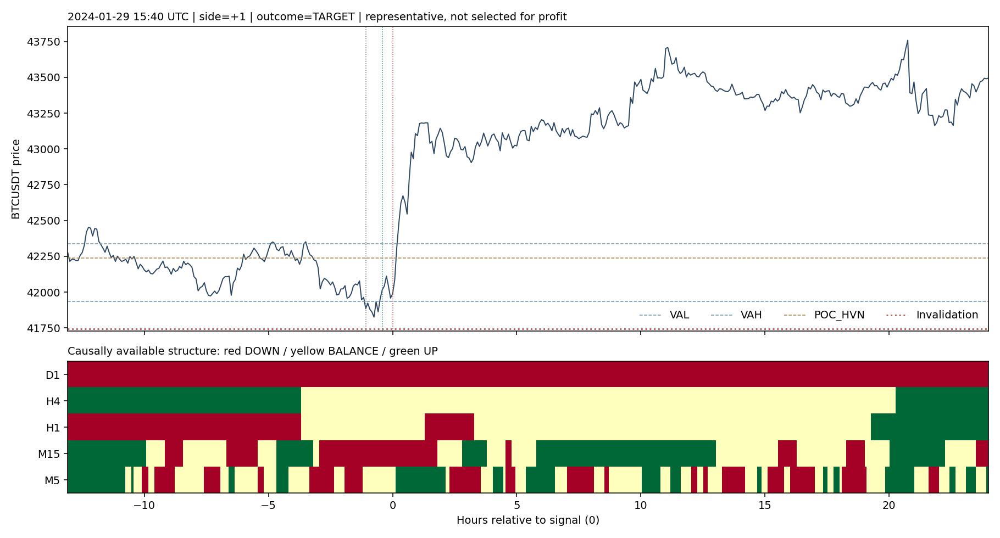

# LAB163 — D1 → H4 → H1 → M15 → M5 × PROFILE

Виконано 2026-10-10. BTCUSDT2021–доступний серпень 2026. Parent LAB162 `bbe97e66e5276b123482571b65176bed65b72f18`. M1 не використовується. Production без змін.

## Результат

**Додавання цього конкретного визначення багатомасштабного контексту не дало підтвердженого стабільного покращення.** Воно відокремило деякі різні ситуації, але найсильніша відібрана перевага 2021–2024 не повторилася у 2025–2026. Це не доказ, що тренд неважливий або будь-яка торгівля профілем неможлива.

Також перевірено конкретний сценарій **вихід за VAH/VAL → повернення всередину value → невдалий повторний вихід → POC**. У пізнішому періоді POC досягався раніше інвалідації приблизно 44% часу. Число не є PF або торговим winrate: тут close-бар'єри без виконання й витрат, різні відстані доцілі/інвалідації та окремі timeout.

## Як визначено контекст без майбутніх даних

Для D1/H4/H1/M15/M5 агрегація за UTC, лише повністю закриті свічки. Swing high/low підтверджується двома свічками ліворуч і двома праворуч; стає відомим лише на close другої правої. UP — останні два підтверджені максимуми та мінімуми обидва зростають; DOWN — обидва падають; інакше BALANCE. До появи двох екстремумів обох типів — UNKNOWN. Фаза IMPULSE/PULLBACK — знак останнього 3-свічкового руху відносно структурного напрямку.

Узгодження всіх таймфреймів не вимагалося. Перевірено WITH/AGAINST/BALANCE щодо напрямку підходу, поєднання старших трендів, H1 відкат/імпульс, локальні M15/M5 та форми профілю/OI/Crowd. Це операційна розмітка, не єдине можливе визначення тренду; підтвердження екстремумів має природну затримку.

## Контакти з рівнями: сильний кандидат не втримався

Збережено рівно ті самі 19665 подій LAB162 (19662 після 6h-purge), ті самі рівні та результати±1ATR за 6h від close контакту. База порівняння — той самий рівень, тип close та напрямок підходу.

Розглянуто 8258 комірок десяти наперед заданих сімейств,16516 порівнянь PASS/REJECT. Лише 157 комірок мають достатню підтримку discovery≥100 подій/20 тижнів і validation≥30/10 тижнів. Порогові вимоги приросту≥10 п.п. у 2021–2023 та≥5 п.п. у 2024 пройшли 2 рядки, але **це один і той самий набір подій**, а не дві незалежні знахідки: H1=BALANCE автоматично має фазу FLAT.

Єдиний сценарій: підхід вниз до POC/HVN, контакт закрився назад над рівнем, структура H4 проти підходу (UP), H1=BALANCE. Частка подальшого проходу вниз на 1ATR раніше зустрічного 1ATR:

| Період | N | У сценарії | У відповідній базі | Різниця |
|---|---:|---:|---:|---:|
|2021–2023|112|48,2%|36,7%|+11,5 п.п.|
|2024|32|50,0%|38,5%|+11,5 п.п.|
|2025–2026|52|25,0%|39,7%|−14,7 п.п.|

Тижневий bootstrap95%CI різниці у CHECK:−25,0…−4,9 п.п. Результат змінив знак; не переносимо його в бот. Інтервал умовний на цей пошук, без заяви про pristineOOS та без корекції всієї історії багаторазових досліджень. Пороги після результату не послаблено.

## Конкретна послідовність failed break

Два фіксовані профілі: ROLL24 — trailing24h перед breakout; PRIOR_DAY — профіль останнього завершеного UTC-дня, доступний перед breakout. POC/VAL/VAH і ATR на breakout заморожуються.

Правила: breakout-close за VAH/VAL на 0,1ATR із попереднього close всередині value; повернення всередину протягом 6h; повторний тест межі протягомнаступних 3h і close≥0,1ATR назад усередині. На сигнал у бік POC потрібно≥0,5 поточного ATR доцілі. Інвалідація — за екстремумом усього відрізка breakout→trigger плюс 0,1breakoutATR. Горизонт 24h, перша close-подія POC/інвалідація/timeout. Один pending сценарій на режимпрофілю, cooldown6h. Однакові епізоди двох режимів можуть перекриватися.

Усього 2817 сценаріїв до 24h-purge. Всі правила задано до результатів. Профіль останнього балансу/імпульсу тут ще не реалізований: перевірено саме rolling24h і попередній UTC-день.

| split | mode | n | target_pct | stop_pct | timeout_pct | route_atr_median | risk_atr_median | rr_median |
| --- | --- | --- | --- | --- | --- | --- | --- | --- |
| CHECK | PRIOR_DAY | 347 | 43.80 | 51.59 | 4.61 | 1.19 | 0.89 | 1.29 |
| CHECK | ROLL24 | 476 | 43.91 | 52.52 | 3.57 | 1.09 | 0.94 | 1.16 |
| DISCOVERY | PRIOR_DAY | 608 | 43.91 | 51.15 | 4.93 | 1.12 | 0.92 | 1.21 |
| DISCOVERY | ROLL24 | 859 | 47.15 | 49.83 | 3.03 | 0.98 | 0.91 | 1.08 |
| VALIDATION | PRIOR_DAY | 213 | 39.44 | 56.34 | 4.23 | 1.26 | 0.96 | 1.32 |
| VALIDATION | ROLL24 | 312 | 50.32 | 46.15 | 3.53 | 1.00 | 0.99 | 1.08 |



`rr_median` — медіана відношення початкових цінових відстаней до POC та інвалідації. Її не можна множити на агреговану частку успіхів і називати отриманий результат EV: розміри та результати пов'язані, timeout має окремий шлях. Показники не враховують execution та costs.

## Старший контекст сценарію в 2025–2026

HIGHER_WITH: D1 і H4 у напрямку сигналу на POC; HIGHER_AGAINST: обидва проти; MIXED_BALANCE: інші відомі поєднання.

| mode | higher_context | n | target_pct | stop_pct | rr_median |
| --- | --- | --- | --- | --- | --- |
| PRIOR_DAY | HIGHER_AGAINST | 35 | 48.57 | 48.57 | 1.17 |
| PRIOR_DAY | HIGHER_WITH | 32 | 37.50 | 59.38 | 1.53 |
| PRIOR_DAY | MIXED_BALANCE | 280 | 43.93 | 51.07 | 1.27 |
| ROLL24 | HIGHER_AGAINST | 39 | 38.46 | 56.41 | 1.43 |
| ROLL24 | HIGHER_WITH | 39 | 46.15 | 53.85 | 1.06 |
| ROLL24 | MIXED_BALANCE | 398 | 44.22 | 52.01 | 1.18 |

При ROLL24 узгодження D1/H4 має 46,2% досягнення POC проти 38,5% при протилежному контексті, але **лише 39 випадків у кожній групі**. У PRIOR_DAY картина інша:37,5% за старшим напрямком проти 48,6% проти нього (32/35 випадків). Це малі й неоднорідні групи, а не підтверджене правило «торгувати тільки за трендом».

Повні таблиці заформаю P/B/b/D та поєднанням H1/M15 збережені, але кращі дрібні підгрупи не оголошуються новими переможцями після перегляду CHECK.

## Приклад із контекстом

Приклад 2024ROLL24 обрано найближчим до медіан відстані до POC та інвалідації, без вибору за результатом. Горизонтальні рівні заморожені перед breakout; нижче — контекст, який реально був відомий на кожному close. Нульчасу — підтвердженийсигнал; це дослідницький сценарій, не виконана угода.



## Перевірки й межі

- Синтетично перевірено затримку підтвердження свінгу, prefixinvariance, оновлення старших TF лише на їх close.
- Контактні результати точно збігаються з LAB162; рівні scenario відомідо breakout; trigger пізніше re-entry; cooldown і purge перевірені.
- Перераховано результати на вибірці кожного 7-госценарію без використання збереженого outcome; значеннязбігаються.
- Початковий UNKNOWN збережено, дані не домальовано; D1 стаєдоступним 2021-01-14. Часткиконтекстів у LAB163_context_coverage.csv.
- Profile реконструйованоіз M5volume,24h/40bins; B — структурнийдвогорбий LAB162, не старий DOUBLE. Затримка flow5 хв — припущенняджерела, не перевірена live доставка.
- H1phase — лише рухостанніх 3 закритихбарів відносноструктури. Це не повна семантика імпульсу/відкату, не ручна розмітка графіка. Існують інші визначення, але їх не підбирали за CHECK.
- Множинність комбінацій велика, більшість комірок малі. Негативний результат обмежений цим конкретним протоколом. Роки вже використовувалися проектом, тож це не pristineOOS.
- Немає прибутковості/PF/DD або зміни production. Наявність тренду не гарантує прогнозованоїреакції конкретного рівня.

## Відтворення

Потрібен відновлюваний LAB162_tape.pkl і LAB162_encounters.csv із попереднього LAB. Джерела/hash успадковані LAB162. Запуск із repo root:

```bash
python3 labs/LAB163_MULTITIMEFRAME_PROFILE_CONTEXT_20261010/run.py
python3 labs/LAB163_MULTITIMEFRAME_PROFILE_CONTEXT_20261010/analyze.py
python3 labs/LAB163_MULTITIMEFRAME_PROFILE_CONTEXT_20261010/verify.py
python3 labs/LAB163_MULTITIMEFRAME_PROFILE_CONTEXT_20261010/build_report.py
```

Архів: код, протокол, M5-рядкиконтексту CSV.gz, всі contact/scenario події, повнікомірки, summaries, графіки, перевірки. Проміжний context.pkl відтворюється run.py і не включений.
