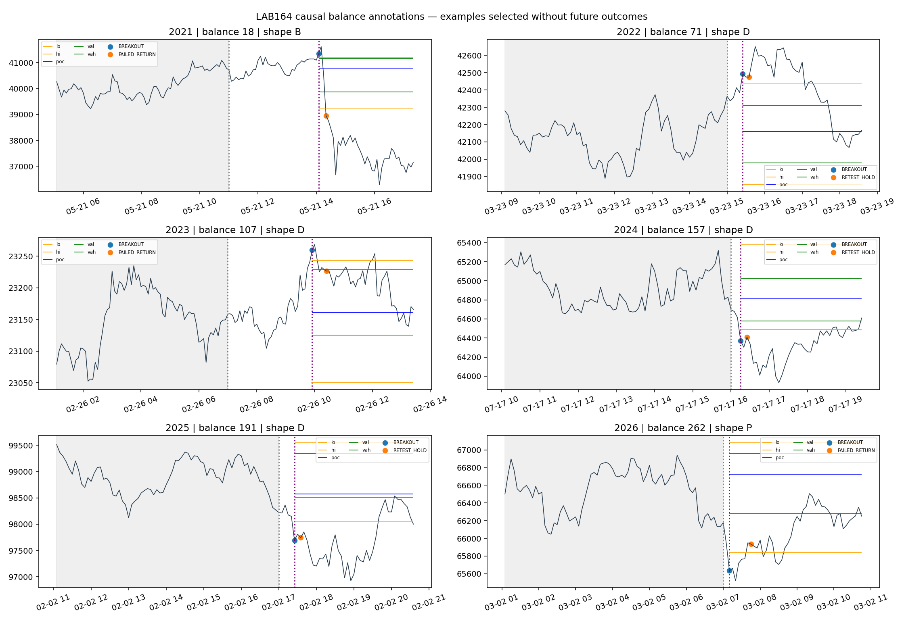

# LAB164 — ANCHORED BALANCE × BREAKOUT × RETEST × FLOW

Завершено 2026-10-10. Дані BTC M5 за 2021-01 — 2026-08-10; контекст D1/H4/H1/M15/M5, без M1. Production не змінювався.

## Головний висновок

Розділення **ринкового сценарію, сигналу та геометрії входу** виявило конкретну проблему: підтвердження може відбирати цікаві епізоди, але приходити запізно. У CHECK ретест має 40.35% успіху проти 36.08% усіх пробоїв; проте на **тих самих 57 епізодах** перший пробій має 45.61%, а ретест — 40.35%. Порівняння тих самих епізодів ретроспективне: наперед невідомо, які пробої матимуть ретест. Це не готовий спосіб торгувати тільки ці пробої.

Для FAILED_RETURN медіана відстані до POC — **0.479 ATR**, до інвалідації — **0.860 ATR**. У 7 із 31 сигналів ціна вже пройшла POC. Правильно описаний розворот ще не означає хороший вхід.

## Що саме пораховано

Баланс визначається на закритому H1 за останніми шістьма барами: ширина 1–4 ATR, ефективність шляху <=0.35, >=3 перетинів середини, >=2 закриттів у кожній зовнішній третині. Межі фіксуються при виявленні. Це **одна вузька формалізація**, а не всі трейдерські баланси. Наступний баланс використовує лише бари після завершення попереднього епізоду.

Профіль починається з першої M5 свічки знайденого балансу й накопичується до бару перед пробоєм. Після цього він заморожений: POC, VAH/VAL, HVN2, LVN, P/B/b/D. 40 bins, рівномірний розподіл обсягу всередині high–low M5; не footprint. Форма відрізняється від trailing24h у 60.9% пробоїв. Це доводить різницю ознак, а не її торгову цінність.

Пробій: закриття на 0.1 ATR поза межами. Протягом 6h перша підтверджена гілка: дотик межі та два закриття ззовні (RETEST_HOLD), або два закриття всередині (FAILED_RETURN). Повторні пізні гілки цього епізоду не рахуються. Два закриття — операційне підтвердження, не доказ стійкого прийняття ціни.

Знайдено **281 балансів**, 274 пробої, 156 ретестів, 97 повернень, 21 непідтверджений вихід, 7 балансів без виходу за 24h. Разом 527 спостережень стадій, але **не 527 незалежних угод**. Первинні незалежні одиниці — баланси.

Графіки обрано механічно по одному на рік за близькістю ширини до медіани, без відбору за результатом. Перегляд до оцінки майбутнього руху підтвердив наявність коливань; показав також затримку повернення до POC. Параметри після перегляду не змінювалися.

## Рух після сигналу

Успіх: майбутнє закриття досягає +2 ATR раніше за −1 ATR у наступні 24h. ATR фіксований на сигналі. «Хибний» тут включає несприятливий бар'єр першим і невирішені випадки. Це не win rate торгової системи: угоди, intrabar SL/TP та costs не симулювалися.

| split | stage | n | success_pct | adverse_first_pct | unresolved_pct | median_mfe | median_delay |
| --- | --- | --- | --- | --- | --- | --- | --- |
| CHECK | BREAKOUT | 97 | 36.082 | 60.825 | 3.093 | 1.717 | 0.000 |
| CHECK | FAILED_RETURN | 31 | 35.484 | 51.613 | 12.903 | 2.058 | 30.000 |
| CHECK | RETEST_HOLD | 57 | 40.351 | 56.140 | 3.509 | 2.654 | 20.000 |
| DISCOVERY | BREAKOUT | 128 | 25.000 | 72.656 | 2.344 | 1.708 | 0.000 |
| DISCOVERY | FAILED_RETURN | 48 | 45.833 | 54.167 | 0.000 | 2.122 | 20.000 |
| DISCOVERY | RETEST_HOLD | 73 | 31.507 | 67.123 | 1.370 | 1.602 | 25.000 |
| VALIDATION | BREAKOUT | 49 | 22.449 | 75.510 | 2.041 | 1.707 | 0.000 |
| VALIDATION | FAILED_RETURN | 18 | 38.889 | 55.556 | 5.556 | 2.712 | 17.500 |
| VALIDATION | RETEST_HOLD | 26 | 19.231 | 73.077 | 7.692 | 1.713 | 12.500 |

Парне порівняння, що відокремлює зміну вибірки від очікування підтвердження:

| stage | split | n | break_success_pct | later_success_pct | median_delay | median_directional_price_change_atr | median_remaining_route |
| --- | --- | --- | --- | --- | --- | --- | --- |
| RETEST_HOLD | CHECK | 57 | 45.614 | 40.351 | 20.000 | 0.086 | 1.549 |
| RETEST_HOLD | DISCOVERY | 73 | 30.137 | 31.507 | 25.000 | 0.050 | 1.536 |
| RETEST_HOLD | VALIDATION | 26 | 23.077 | 19.231 | 12.500 | 0.128 | 1.656 |
| FAILED_RETURN | CHECK | 31 | 3.226 | 35.484 | 30.000 | -0.502 | 0.479 |
| FAILED_RETURN | DISCOVERY | 48 | 8.333 | 45.833 | 20.000 | -0.519 | 0.375 |
| FAILED_RETURN | VALIDATION | 18 | 5.556 | 38.889 | 17.500 | -0.669 | 0.514 |

Для FAILED_RETURN напрямок пізнішого сигналу протилежний пробою. Його парне порівняння не є порівнянням двох входів в один напрямок.

## Геометрія конкретного сценарію

Продовження: ціль — одна ширина балансу від пробитої межі, скасування — 0.1 ATR всередині. Повернення: ціль POC, скасування — за екстремумом спроби пробою +0.1 ATR. Результати нижче тільки для додатної відстані до цілі й скасування; перевірка за майбутніми **закриттями**, без виконання ордерів.

| split | stage | n | positive_geometry | already_passed | target_first_pct | invalidation_first_pct | timeout_pct | median_rr |
| --- | --- | --- | --- | --- | --- | --- | --- | --- |
| CHECK | BREAKOUT | 97 | 96 | 1 | 28.125 | 70.833 | 1.042 | 5.335 |
| CHECK | FAILED_RETURN | 31 | 24 | 7 | 66.667 | 33.333 | 0.000 | 0.816 |
| CHECK | RETEST_HOLD | 57 | 57 | 0 | 38.596 | 59.649 | 1.754 | 3.999 |

Вузькі рівні скасування для continuation особливо чутливі до intrabar руху і витрат. Ці показники не дають PF/EV реального виконання. Медіанне RR не можна множити на загальний відсоток успіху для розрахунку EV.

## Чи додають Crowd, OI та профіль інформацію

Фіксована logistic regression C=1: навчання тільки 2021–2023; 2024 validation; 2025–2026 CHECK без перенавчання. Ціна включає структуру п'яти TF, ширину/ефективність балансу, прогрес за годину та відносний обсяг. Потім L/S і зміна crowd z, OI quantity за годину, потім anchored profile. Збережено відстань до відомих H1/H4 swing obstacles й price progress / relative volume. Ці ознаки не ідентифікують причинно «хто штовхає» ціну.

Однакова повна вибірка: лише 123 навчальні пробої, 49 validation, 96 CHECK. Шість пробоїв виключено через відсутні ознаки. Для такої кількості ознак навчальна вибірка мала. Інтервали — paired bootstrap за тижнями, 500 повторів; не враховують невизначеність самого навчання.

| model | split | n | train_n | brier | constant_train_brier | auc | delta_vs_previous | delta_ci_low | delta_ci_high |
| --- | --- | --- | --- | --- | --- | --- | --- | --- | --- |
| PRICE_CONTEXT | VALIDATION | 49 | 123 | 0.173 | 0.175 | 0.498 | nan | nan | nan |
| PRICE_CONTEXT | CHECK | 96 | 123 | 0.251 | 0.244 | 0.512 | nan | nan | nan |
| PLUS_CROWD | VALIDATION | 49 | 123 | 0.169 | 0.175 | 0.557 | -0.004 | -0.024 | 0.010 |
| PLUS_CROWD | CHECK | 96 | 123 | 0.257 | 0.244 | 0.505 | 0.006 | -0.004 | 0.016 |
| PLUS_OI | VALIDATION | 49 | 123 | 0.172 | 0.175 | 0.574 | 0.003 | -0.003 | 0.009 |
| PLUS_OI | CHECK | 96 | 123 | 0.253 | 0.244 | 0.538 | -0.003 | -0.008 | 0.001 |
| PLUS_ANCHORED_PROFILE | VALIDATION | 49 | 123 | 0.174 | 0.175 | 0.545 | 0.002 | -0.017 | 0.018 |
| PLUS_ANCHORED_PROFILE | CHECK | 96 | 123 | 0.245 | 0.244 | 0.606 | -0.008 | -0.021 | 0.006 |

У CHECK профіль знижує Brier на 0.0079 та піднімає AUC приблизно 0.538 → 0.606; інтервал різниці Brier **перетинає нуль**. У 2024 додавання профілю погіршує Brier. Повна модель CHECK майже дорівнює простому прогнозу сталої частоти з навчання. Стабільна додаткова цінність не підтверджена; це не доказ відсутності взаємозв'язків загалом. Інтеракції та нелінійні моделі тут не досліджувалися.

## Скільки хвиль впізнано

Успадковані незалежні хвилі M5 close з відкатом 1 H1 ATR та амплітудою >=3 ATR. Зараховується сигнал потрібного напрямку до вершини, якщо залишився >=1 ATR і вершина не далі 24h. Хвилі — ретроспективні мітки для аудиту, не відомі на вході.

| split | stage | waves | recognized | coverage_pct | signals | median_remaining_atr |
| --- | --- | --- | --- | --- | --- | --- |
| CHECK | BREAKOUT | 818 | 27 | 3.301 | 97 | 2.109 |
| CHECK | RETEST_HOLD | 818 | 17 | 2.078 | 57 | 2.104 |
| CHECK | FAILED_RETURN | 818 | 5 | 0.611 | 31 | 2.678 |

Об'єднання трьох стадій впізнало **34/818 = 4.16%** хвиль CHECK (без подвійного рахунку). Стадії окремо додавати не можна. Медіана залишкового руху умовна — тільки серед упізнаних хвиль. Покриття не означає фактично взятий прибуток. Прямого порівняння з попередніми 91.6% немає: там інший період і фактичні позиції.

Детектор дає приблизно чотири первинні пробої на місяць у довгій історії. Отже він **не вирішує задачу масового розширення охоплення рухів**. Перш ніж послаблювати цей детектор, потрібна незалежна ручна розмітка бажаних типів балансів/імпульсів: інакше ми знову підлаштуємо правила під результат.

## Межі висновку й відтворення

Це development-дослідження на вже багаторазово використаній історії, не pristine OOS. Не перебирали пороги за майбутнім P/L. Результат не є підставою міняти production або ризик. Вузький баланс, коротке підтвердження, реконструйований профіль та обмежена кількість епізодів залишають інші механізми відкритими.

Перевірено prefix invariance детектора, збереження суми обсягу профілю, неперетин балансів, часовий порядок, унікальність стадій, відсутність майбутніх барів у профілі, повторний розрахунок кожного 17-го label. Вхідні дані й causal TF успадковано з LAB162/LAB163; перевірки їхнього джерела наведено у lineage.json.

Відтворення з кореня ResearchOS: `python3 labs/LAB164_ANCHORED_BALANCE_AUCTION_20261010/run.py`, потім `evaluate.py` і `report.py` з тієї ж папки. Потрібні кеші LAB162_tape.pkl і LAB163_context.pkl та LAB161_waves.csv; їхні генератори є у попередніх LAB. Залежності: numpy, pandas, matplotlib, scikit-learn. В архіві код, фіксований протокол, всі події, таблиці, графіки й перевірки; великі відтворювані кеші не дублюються.
