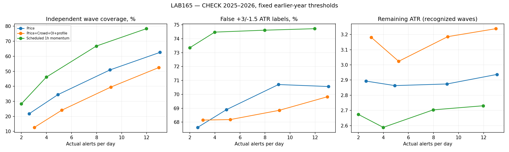

# LAB165 — BROAD COVERAGE DETECTOR

Завершено 2026-10-10. **Охоплення розширено шляхом зміни детектора, без обов'язкового балансу, ретесту чи жорсткого profile/Z gate.** Це дослідницький генератор сигналів, production EA не змінений.

## Конкретний результат

Фіксований до розрахунку основний режим — FULL, орієнтир4 сигнали/добу, глобальна пауза1h. На CHECK2025–2026: **196/813 хвиль = 24.11%**, фактично 5.22 сигналів/добу. На тому самому наборі хвиль LAB164 розпізнав 34; новий режим додав 185 раніше не розпізнаних, водночас пропустив 23 з тих, що бачив LAB164. Це не об'єднання двох стратегій.

Ціна розширення: **68.18% хибних міток** за критерієм +3ATR раніше за−1.5ATR у24h. Це не відсоток збиткових угод. Медіанний залишок до вершини серед розпізнаних хвиль — 3.02 ATR; без ретроспективної вершини він наперед невідомий.

## Що змінено

Використано заморожені причинні моделі LAB161: PRICE та PRICE+Crowd+OI+PROFILE. Кожен доступний M5 оцінюється без вимоги конкретного патерну. Напрямок — більша з оцінок UP/DOWN, якість — її значення. Пауза знижена з6h до1h. Пороги для2/4/8/12 сигналів/добу калібровано **лише на попередньому році за частотою**, без використання результатів наступного року. Порогова частота не є жорстким денним лімітом.

PRICE охоплює різні масштаби до24h та ширші діапазони; тут не додавали структурні ознаки D1/H4 з LAB163, щоб ізолювати зміну політики сигналів. PROFILE — trailing24h legacy D/P/b/DOUBLE з LAB161, не anchored profile LAB164. Розширення не є новим доказом переваги профілю. M1 не використано.

Окремий контроль CLOCK — фіксовані UTC години з напрямком останньої години. Він показує, скільки охоплення можна отримати просто більшою кількістю спроб. Його фактична частота може відрізнятися від каліброваних моделей; це наближене, не точне зрівнювання кількості сигналів.

## Повна таблиця CHECK2025–2026

| policy | per_day | recognized | waves | coverage_pct | false_pct | median_remaining_atr | clean_coverage_pct |
| --- | --- | --- | --- | --- | --- | --- | --- |
| CLOCK_1H_MOMENTUM_R12 | 11.97 | 637 | 813 | 78.35 | 74.72 | 2.73 | 51.66 |
| CLOCK_1H_MOMENTUM_R2 | 2.00 | 230 | 813 | 28.29 | 73.35 | 2.67 | 17.84 |
| CLOCK_1H_MOMENTUM_R4 | 3.99 | 375 | 813 | 46.13 | 74.48 | 2.59 | 29.40 |
| CLOCK_1H_MOMENTUM_R8 | 7.98 | 543 | 813 | 66.79 | 74.61 | 2.70 | 44.77 |
| PRICE_CROWD_OI_PROFILE_OLD6H_R2 | 2.17 | 178 | 813 | 21.89 | 68.98 | 2.99 | 14.76 |
| PRICE_CROWD_OI_PROFILE_R12 | 12.97 | 427 | 813 | 52.52 | 69.82 | 3.24 | 39.73 |
| PRICE_CROWD_OI_PROFILE_R2 | 3.04 | 103 | 813 | 12.67 | 68.15 | 3.18 | 9.47 |
| PRICE_CROWD_OI_PROFILE_R4 | 5.22 | 196 | 813 | 24.11 | 68.18 | 3.02 | 18.33 |
| PRICE_CROWD_OI_PROFILE_R8 | 9.14 | 321 | 813 | 39.48 | 68.85 | 3.19 | 29.27 |
| PRICE_OLD6H_R2 | 2.14 | 217 | 813 | 26.69 | 71.73 | 2.46 | 15.99 |
| PRICE_R12 | 13.07 | 509 | 813 | 62.61 | 70.56 | 2.94 | 45.39 |
| PRICE_R2 | 2.62 | 177 | 813 | 21.77 | 67.62 | 2.89 | 15.25 |
| PRICE_R4 | 4.91 | 280 | 813 | 34.44 | 68.89 | 2.86 | 23.74 |
| PRICE_R8 | 9.08 | 414 | 813 | 50.92 | 70.70 | 2.87 | 34.81 |

OLD6H_R2 — незмінний старий детектор LAB161. R2/R4/R8/R12 — новий cooldown1h. Усі варіанти наведено, переможця за майбутнім прибутком не обирали.

## Що показав контроль

CLOCK_R4 охопив46.13% хвиль при3.99 сигнала/добу, але74.48% хибних міток. FULL_R4 охопив24.11% при5.22 сигнала/добу та68.18% хибних. Отже, модель знижує частку хибних міток, але концентрує сигнали в меншій кількості хвиль; її перевага для широкого пошуку не встановлена. Це порівняння різної фактичної частоти, без твердження статистичної значущості.

За малих цільових частот скорочення cooldown саме по собі може **зменшити** охоплення: FULL_R2 дає12.67% проти21.89% старого OLD6H_R2, попри більше сигналів. Поріг, відкалібрований під коротшу паузу, допускає скупчення спроб у сильних локальних оцінках. Тому збережено повну криву, а не твердження, що кожне послаблення покращує всі показники.

Режим FULL_R4 зафіксований як дослідницький варіант до результатів, не оголошується найкращим. Для максимально широкого переліку кандидатів CLOCK_R12 покриває78.35%, проте74.72% його міток хибні. Це вже широкий пошук, а не доказ готової торгової стратегії.

## Стабільність основного режиму за роками

| period | per_day | recognized | waves | coverage_pct | false_pct | median_remaining_atr | clean_coverage_pct |
| --- | --- | --- | --- | --- | --- | --- | --- |
| 2024 | 3.30 | 116 | 496 | 23.39 | 65.39 | 2.83 | 17.34 |
| 2025 | 6.87 | 155 | 518 | 29.92 | 68.59 | 2.96 | 22.78 |
| 2026 | 2.52 | 41 | 295 | 13.90 | 66.37 | 3.39 | 10.51 |

## Порівняння з LAB164 на однакових хвилях

| policy | waves | lab164_recognized | lab165_recognized | shared | additional_vs164 | missed_old |
| --- | --- | --- | --- | --- | --- | --- |
| CLOCK_1H_MOMENTUM_R12 | 813 | 34 | 637 | 32 | 605 | 2 |
| CLOCK_1H_MOMENTUM_R2 | 813 | 34 | 230 | 17 | 213 | 17 |
| CLOCK_1H_MOMENTUM_R4 | 813 | 34 | 375 | 24 | 351 | 10 |
| CLOCK_1H_MOMENTUM_R8 | 813 | 34 | 543 | 27 | 516 | 7 |
| PRICE_CROWD_OI_PROFILE_OLD6H_R2 | 813 | 34 | 178 | 11 | 167 | 23 |
| PRICE_CROWD_OI_PROFILE_R12 | 813 | 34 | 427 | 16 | 411 | 18 |
| PRICE_CROWD_OI_PROFILE_R2 | 813 | 34 | 103 | 7 | 96 | 27 |
| PRICE_CROWD_OI_PROFILE_R4 | 813 | 34 | 196 | 11 | 185 | 23 |
| PRICE_CROWD_OI_PROFILE_R8 | 813 | 34 | 321 | 12 | 309 | 22 |
| PRICE_OLD6H_R2 | 813 | 34 | 217 | 15 | 202 | 19 |
| PRICE_R12 | 813 | 34 | 509 | 25 | 484 | 9 |
| PRICE_R2 | 813 | 34 | 177 | 9 | 168 | 25 |
| PRICE_R4 | 813 | 34 | 280 | 12 | 268 | 22 |
| PRICE_R8 | 813 | 34 | 414 | 20 | 394 | 14 |

Сирі 4.2% LAB164 і показники LAB165 не порівнюємо напряму: для цього розрахунку залишено тільки спільне часове вікно та однакові ідентифікатори хвиль. Попередні91.6% стосувалися іншого періоду й фактичних позицій. Також не порівнюємо успішність+2/−1ATR LAB164 з+3/−1.5ATR LAB165.

## Методика й межі

Хвилі — успадковані M5close рухи амплітудою>=3H1ATR, підтверджені відкатом1ATR. Кожну хвилю рахують один раз на політику. Сигнал має бути потрібного напрямку після початку хвилі та до вершини, зі щонайменше1ATR залишку й вершиною в межах24h. Додатково збережено охоплення із залишком2/3ATR, частку хвиль із хоча б одним чистим+3/−1.5 сигналом, повторні сигнали всередині хвилі та хвилі на100 сигналів.

Велике охоплення саме по собі не означає edge: один рух може отримати багато стрілок. Висока частка хибних сигналів потребує окремого дослідження входу/ризику; цей LAB не симулює fills,SL/TP,costs чи portfolio. Залишковий рух обчислено умовно на вже відомих розпізнаних хвилях. Це не гарантований доступний прибуток.

Історія вже використовувалася в попередніх LAB. Хоча моделі навчалися на минулому, цей аналіз не pristine OOS. Моделі не перенавчали й пороги не оптимізували за хвилями CHECK. Оцінки UP/DOWN не оголошуються каліброваними торговими ймовірностями.

## Що готове для повторного використання

`detector.py`: пакетний emit і станний AlertDetector з однаковою логікою. `detector_config.json`: фіксований режим4/добу й пороги кожного року. `models/`: шість заморожених моделей з feature lists. Для запуску потрібен причинний розрахунок ознак LAB161 на закритих M5; часу останнього сигналу потрібно надати збереження між перезапусками. Це не встановлений MT5 індикатор та не зміна активного бота. Пороги2026 не видаються за відкалібровані для майбутнього2027.

Відтворення з кореня ResearchOS: `python3 labs/LAB165_BROAD_COVERAGE_DETECTOR_20261010/run.py`, потім аналогічно `report.py`. Потрібні LAB161_dataset.pkl, його frozen models/predictions/folds/waves та LAB164_wave_matches. Залежності numpy,pandas,scikit-learn,joblib,numba,matplotlib. Вхідні кеші створюються попередніми LAB, не дублюються в архіві.

Перевірки: точна відповідність старих охоплень LAB161; prefix parity пакетного й послідовного detector; cooldown; часовий purge навчання/калібрування. Усю частоту й coverage рахували на однакових eligible M5 та хвилях. Відсутні/неякісні дані й особливості OI/L/S успадковані з LAB161; це не новий аудит джерел.
