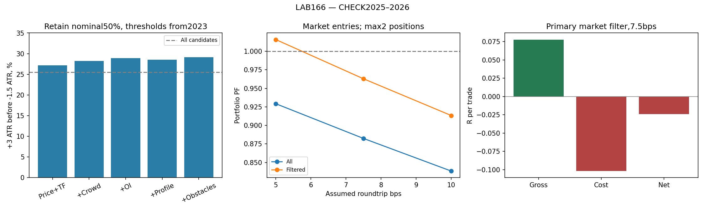
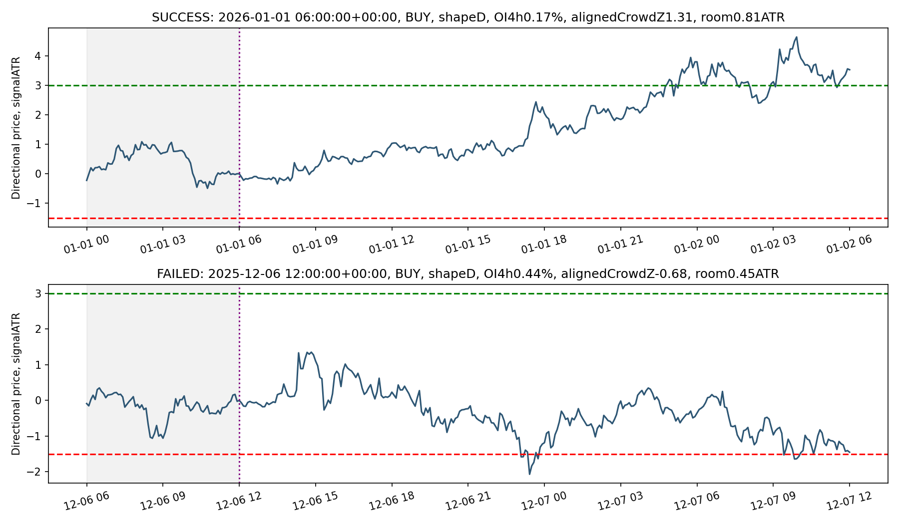

# LAB166 — ВДАЛІ ТА НЕВДАЛІ ПОЧАТКИ × ENTRY × COSTS

Завершено 2026-10-10. **Відбір до входу покращив якість сигналів, але перевага не витримала 7.5bps витрат у сукупному CHECK2025–2026.** Production не змінений.

## Результат, який відповідає на поставлене питання

Базові початки мають 25.52% виконань +3ATR раніше за−1.5ATR у 24h. Причинний відбір за ціною, трендом, Crowd, OI, профілем та відомими рівнями має **29.15%**, залишаючи 1156/2335 сигналів. Приріст **3.63 п.п.**, тижневий bootstrap95%CI [2.06;5.43]. Він повторюється за знаком у 2024,2025,2026. Інтервал умовний на вже навчену модель, не враховує невизначеність навчання або весь попередній пошук LAB.

Market next-open у портфелі максимум 2 позиції: до витрат **EV+0.078R, PF1.13**. Середня вартість 7.5bps — **0.102R/угоду**. Після витрат **EV-0.024R, PF0.96, -1.32R/місяць**, 54.9 угоди/місяць. Отже, ознаки несуть невелику корисну інформацію, але перевірений торговий перенос залишається недостатнім.

## Дані, сигнали та перевірка часу

Основний потік широкий: на закритті M5 у 00/06/12/18UTC напрямок за останньою годиною. Без майбутніх екстремумів, вимоги балансу/ретесту або profile gate. У тестових роках сигнали й мітки точно збігаються з LAB165 CLOCK_1H_MOMENTUM_R4. Повна кількість 7969; розподіл: {'FIT': 2728, 'CHECK': 2335, 'CAL': 1449, 'VALIDATION': 1441, 'PURGED': 16}.

Ознаки причинні на момент сигналу: підтверджена структура D1/H4/H1/M15/M5, ціна 5m–24h/прискорення/ефективність/обсяг/тіло/тіні; OI quantity1h/4h/24h і прискорення; countL/S та crowdZ/зміни; trailing24h P/B/b/D,POC,VAH/VAL,HVN2,LVN, міграція; відстань до відомих H1/H4 swing і профільних рівнів попереду. Рівні — можливі перешкоди, не гарантовані точки зупинки. Відстані менше 0.1ATR не враховуються; відсутність рівня позначена окремо, відстань обмежено 10ATR.

OI<=0 масковано; в сирому джерелі 473 такі рядки. L/S — співвідношення кількості акаунтів, не розмірів позицій. Flow delay5min — успадковане припущення, не виміряна live затримка. Профіль реконструйований з M5high-low40bins, не tickfootprint. B — дві розділені вершини зі структурним valley, не legacyDOUBLE.

Кеш LAB162_tape був обрізаний, тому цей LAB відновив вузли профілю та OI з неушкодженого LAB161pricecache й оригінального flowZIP, не використовував пошкоджений файл. Список missing predictors є у feature_missingness.csv; модель допускає пропуски, вони не заповнюються майбутнім.

## Як саме відрізняються добрі й погані початки

Усі порівняння збережено, наведені нижче ознаки не обиралися за прибутком CHECK. SMD — різниця середніх good-minus-bad у одиницях pooledSD; це асоціація, не причинне пояснення.

| feature | success_n | failure_n | success_median | failure_median | standardized_difference |
| --- | --- | --- | --- | --- | --- |
| H4_alignment | 596 | 1739 | 0.000 | 0.000 | 0.047 |
| H1_alignment | 596 | 1739 | 0.000 | 0.000 | 0.062 |
| range_288 | 596 | 1739 | 4.966 | 5.087 | -0.064 |
| atr_pct | 596 | 1739 | 0.005 | 0.006 | -0.214 |
| ratio_change_6h | 596 | 1739 | -0.001 | 0.002 | -0.074 |
| oi_change_48 | 596 | 1739 | 0.007 | -0.090 | 0.085 |
| value_width | 596 | 1739 | 2.527 | 2.586 | -0.084 |
| valley_ratio | 470 | 1375 | 0.637 | 0.604 | 0.146 |
| nearest_room_atr | 596 | 1739 | 0.569 | 0.566 | 0.061 |

atr_pct — ATR/ціна; ratio_change_6h — часткова зміна, множення на 100 дає відсотки. Зміни OI тут уже у%. Всі directional ознаки узгоджені з BUY/SELL кандидата.

Найпомітніша стабільна одинична різниця — **нижчий ATR/ціна** у вдалих міток. Вужчі добові діапазони/VA дають сильніший поділ у FIT, слабший у CHECK. Позитивна зміна OI4h має невелику різницю у тому самому напрямку. Ефект перекосу CrowdZ значно слабшає поза FIT. Однозначного правила «вільна дорога>=1ATR означає хороший сигнал» тут немає.

Нижчий ATR/ціна також підвищує costR для незмінних bps — риса, що допомагає price-label, може погіршувати економіку входу. Це показує, чому однієї класифікації рухів недостатньо.

Стабільність 10 ознак із найбільшим|SMD| **саме на FIT**:

| feature | CHECK | FIT | VALIDATION |
| --- | --- | --- | --- |
| atr_pct | -0.214 | -0.221 | -0.308 |
| crowd_z | -0.037 | -0.204 | -0.147 |
| effort_result | 0.050 | -0.121 | -0.020 |
| oi_change_288 | 0.043 | 0.161 | 0.075 |
| range_288 | -0.064 | -0.321 | -0.104 |
| ratio_change_1h | -0.010 | -0.217 | -0.101 |
| ratio_change_6h | -0.074 | -0.138 | -0.155 |
| room_over1atr | -0.013 | -0.109 | -0.080 |
| valley_ratio | 0.146 | 0.157 | 0.215 |
| value_width | -0.084 | -0.299 | -0.120 |

Форма профілю сама по собі в CHECK:

| shape | n | success_pct |
| --- | --- | --- |
| B | 738 | 25.068 |
| D | 978 | 25.358 |
| P | 298 | 27.517 |
| b | 321 | 25.234 |

P/B/b/D не дає універсального сильного поділу в цьому широкому потоці. Це не спростовує LAB159 для конкретної підвибірки R48 — там інші сигнали й сценарій.

## Відбір, визначений до CHECK

Модель фіксована HGB80iter,7leaves,minleaf50,L2=10; FIT2021–2022, CAL2023 лише для порогів, VALIDATION2024, CHECK2025–2026. Пороги 25/50/75%CAL незмінні; первинний режим — всі ознаки й номінальний відбір 50%, визначений у PROTOCOL до результатів. На CHECK не підбирали переможця.

| model | period | selected_n | selected_success_pct | uplift_pp | uplift_ci_low | uplift_ci_high |
| --- | --- | --- | --- | --- | --- | --- |
| PRICE_TREND | VALIDATION | 687 | 27.656 | 3.368 | 1.055 | 5.832 |
| PRICE_TREND | CHECK | 1135 | 27.137 | 1.612 | -0.114 | 3.281 |
| PRICE_TREND | CHECK_2025 | 712 | 26.124 | 1.451 | -0.858 | 4.126 |
| PRICE_TREND | CHECK_2026 | 423 | 28.842 | 1.919 | -1.213 | 5.256 |
| CROWD | VALIDATION | 721 | 28.017 | 3.728 | 1.818 | 5.927 |
| CROWD | CHECK | 1216 | 28.207 | 2.683 | 1.174 | 4.417 |
| CROWD | CHECK_2025 | 754 | 27.984 | 3.311 | 1.158 | 5.589 |
| CROWD | CHECK_2026 | 462 | 28.571 | 1.648 | -0.377 | 3.930 |
| OI | VALIDATION | 720 | 28.333 | 4.045 | 2.044 | 6.249 |
| OI | CHECK | 1212 | 28.878 | 3.353 | 1.840 | 5.082 |
| OI | CHECK_2025 | 750 | 28.533 | 3.861 | 1.751 | 6.276 |
| OI | CHECK_2026 | 462 | 29.437 | 2.514 | 0.032 | 5.167 |
| PROFILE | VALIDATION | 694 | 28.674 | 4.386 | 2.211 | 6.803 |
| PROFILE | CHECK | 1127 | 28.571 | 3.047 | 1.258 | 4.965 |
| PROFILE | CHECK_2025 | 699 | 28.040 | 3.367 | 0.995 | 5.898 |
| PROFILE | CHECK_2026 | 428 | 29.439 | 2.516 | -0.467 | 5.410 |
| OBSTACLES | VALIDATION | 707 | 28.713 | 4.424 | 2.160 | 6.875 |
| OBSTACLES | CHECK | 1156 | 29.152 | 3.628 | 2.057 | 5.429 |
| OBSTACLES | CHECK_2025 | 710 | 28.592 | 3.919 | 2.074 | 6.384 |
| OBSTACLES | CHECK_2026 | 446 | 30.045 | 3.122 | 0.432 | 5.874 |

Ablation на однакових сигналах:

| model | split | n | base_success_pct | brier | constant_brier | auc | average_precision | delta_vs_previous | delta_ci_low | delta_ci_high |
| --- | --- | --- | --- | --- | --- | --- | --- | --- | --- | --- |
| PRICE_TREND | CHECK | 2335 | 25.525 | 0.192 | 0.190 | 0.541 | 0.288 | nan | nan | nan |
| CROWD | CHECK | 2335 | 25.525 | 0.192 | 0.190 | 0.551 | 0.292 | -0.001 | -0.002 | 0.001 |
| OI | CHECK | 2335 | 25.525 | 0.191 | 0.190 | 0.554 | 0.292 | -0.000 | -0.001 | 0.000 |
| PROFILE | CHECK | 2335 | 25.525 | 0.193 | 0.190 | 0.542 | 0.278 | 0.002 | 0.001 | 0.003 |
| OBSTACLES | CHECK | 2335 | 25.525 | 0.193 | 0.190 | 0.541 | 0.277 | -0.000 | -0.001 | 0.001 |

Crowd/OI допомагають цьому відбору, але всі AUC залишаються невисокими. Додавання профілю до OI погіршує CHECK Brier; obstacle ознаки не дають переконливого окремого Brier приросту. У повної моделі Brier навіть трохи гірший за сталу частоту FIT: ranking корисність не означає добре калібровані ймовірності. Не видаємо score за точну ймовірність прибуткової угоди.

## Охоплення після відсікання

| selection | waves | recognized | coverage_pct | clean_coverage_pct | signals |
| --- | --- | --- | --- | --- | --- |
| ALL | 813 | 375 | 46.125 | 29.397 | 2335 |
| CROWD_50 | 813 | 234 | 28.782 | 19.188 | 1216 |
| OBSTACLES_50 | 813 | 225 | 27.675 | 18.327 | 1156 |
| OI_50 | 813 | 238 | 29.274 | 19.803 | 1212 |
| PRICE_TREND_50 | 813 | 208 | 25.584 | 16.605 | 1135 |
| PROFILE_50 | 813 | 217 | 26.691 | 17.958 | 1127 |

Основний відбір знижує rawwave охоплення з 46.13% до 27.68%. Тобто помилки зменшуються, але частина вдалих хвиль теж відсікається. Це не вирішення всієї задачі охоплення. Мітки хвиль ретроспективні: M5close,>=3ATR, відкат 1ATR. Зараховується сигнал до peak із>=1ATR залишку та peak в 24h; залишок умовний на знайдених хвилях, не гарантований прибуток.

Ілюстрації вибрано за label лише для пояснення: success біля медіанного годинного прогресу й найближчий за цим прогресом failure. Це два приклади, не статистичний доказ або навчальне правило.

## Перевірка входів та виконання

MARKET — open наступного M5, DELAY30 — open через 30min, LIMIT025 — ліміт на 0.25signalATR проти напряму з очікуванням 1h. SL1.5signalATR/TP3signalATR від фактичного fill; закриття не пізніше signal+24h. Не оптимізували SL/TP/hold/runner після CHECK.

SL/TP перевірено по high-low: заодночасного торкання SL перший; stopgap за open, TPgap за limit; intrabarlimitfill не отримує оптимістичного TP на тому самому барі. Це консервативний OHLCreplay, не tickexact чи parity з liveMT5.

Спочатку незалежні події, потім причинний портфель max2, включно з pendinglimit та зарезервованими DELAY. Зайнятість перевіряється на сигналі; unfilled і blocked збережені. Same-sideoverlaps дозволені. Ризик 0.25% від **початкового**equity, без compound. MTMDD за закриттями M5, не intrabarworstcase.

Основне порівняння, CHECK2025–2026,7.5bps:

| variant | trades | EV | PF | R_month | trades_month | MTM_DD_pct |
| --- | --- | --- | --- | --- | --- | --- |
| BASE_ALL | 1748 | -0.076 | 0.882 | -6.904 | 90.964 | 35.115 |
| FILTER_MARKET | 1055 | -0.024 | 0.963 | -1.321 | 54.901 | 14.338 |
| FILTER_DELAY30 | 1051 | -0.046 | 0.930 | -2.520 | 54.693 | 16.447 |
| FILTER_LIMIT025 | 726 | -0.025 | 0.962 | -0.945 | 37.780 | 8.473 |

Ліміти виконуються лише на частині кандидатів, тому їхню EV не можна порівнювати як результат одних і тих самих угод. Повна таблиця execution_summary містить всі моделі 50%, остаточні 25/75%, всі 3 входи,3 витрати, незалежні та portfolio результати. Не вибрано прибутковий CHECK варіант для promotion.

## Витрати та роки

bps — **задане сукупне roundtrip припущення** про fee/spread/slippage, не фактична специфікація брокера. Формула costR = bps*0.0001*(entry+exit)/2/(1.5signalATR). Ціни fill не зсуваються додатково, витрати віднімаються агреговано; тому це не replay реального bid/ask.

| mode | cost_bps | n | EV | PF | R_month | mtm_dd_pct |
| --- | --- | --- | --- | --- | --- | --- |
| MARKET | 5.000 | 1055 | 0.010 | 1.016 | 0.545 | 8.682 |
| MARKET | 7.500 | 1055 | -0.024 | 0.963 | -1.321 | 14.338 |
| MARKET | 10.000 | 1055 | -0.058 | 0.913 | -3.188 | 20.524 |
| DELAY30 | 5.000 | 1051 | -0.012 | 0.981 | -0.656 | 10.417 |
| DELAY30 | 7.500 | 1051 | -0.046 | 0.930 | -2.520 | 16.447 |
| DELAY30 | 10.000 | 1051 | -0.080 | 0.882 | -4.384 | 22.615 |
| LIMIT025 | 5.000 | 726 | 0.010 | 1.015 | 0.364 | 5.359 |
| LIMIT025 | 7.500 | 726 | -0.025 | 0.962 | -0.945 | 8.473 |
| LIMIT025 | 10.000 | 726 | -0.060 | 0.912 | -2.254 | 12.808 |

Marketbreak-even для всього CHECK близько 5.73bps, обчислено описово з уже отриманого grossR; не прогноз майбутньої допустимої вартості. При 5bpsPF близько 1.02, що дає дуже малий запас.

| period | mode | n | EV | PF | R_month | mtm_dd_pct |
| --- | --- | --- | --- | --- | --- | --- |
| VALIDATION_2024 | MARKET | 647 | -0.042 | 0.935 | -2.272 | 10.170 |
| VALIDATION_2024 | DELAY30 | 646 | -0.059 | 0.909 | -3.182 | 11.715 |
| VALIDATION_2024 | LIMIT025 | 458 | -0.086 | 0.870 | -3.275 | 11.541 |
| CHECK_2025 | MARKET | 650 | -0.073 | 0.891 | -3.965 | 13.382 |
| CHECK_2025 | DELAY30 | 648 | -0.092 | 0.865 | -4.959 | 15.598 |
| CHECK_2025 | LIMIT025 | 461 | -0.050 | 0.925 | -1.926 | 7.784 |
| CHECK_2026 | MARKET | 405 | 0.054 | 1.089 | 3.036 | 7.532 |
| CHECK_2026 | DELAY30 | 403 | 0.027 | 1.044 | 1.499 | 7.968 |
| CHECK_2026 | LIMIT025 | 265 | 0.018 | 1.029 | 0.671 | 5.974 |

2026 окремо позитивний,2024/2025 негативні. Змішаний результат не підтверджує стійкого торгового edge після 7.5bps.

## Практичний висновок

Ми справді знайшли **невеликий відбір до входу**, а не лише більше стрілок. Однак за перевірених простих входів валова перевага приблизно 0.08R, витрати приблизно 0.10R. Наступна задача має стосуватися збільшення валового EV/ефективнішого виконання або іншого типу початку; ще одне додавання shapegate само по собі тут не обґрунтовано. Не змінюємо production бот на основі цих результатів.

Це повторно використана development історія, не pristineOOS. Відсутній незалежний live період, реальний brokerbid/ask і виміряний latency. Результат конкретної формалізації не доводить неможливості торгувати рухи взагалі.

## Відтворення й перевірки

Запуск зкореня ResearchOS: `prepare.py`, `model.py`, `execution.py`, `verify_and_coverage.py`, `report.py` у labs/LAB166_SUCCESS_FAILURE_ENTRY_EXECUTION_20261010. Потрібні непошкоджений LAB161dataset,LAB163context,LAB165signals/metrics,LAB161waves,profilekernelLAB162 та оригінальний flowZIP. Залежності numpy,pandas,numba,scikit-learn,joblib,matplotlib. Великі runtime кеші не включено, відновлюються prepare.

Перевірки пройдено: exactLAB165signal/label/waveparity; featureprefixinvariance; sampledlabelrecompute; навчання/калібрування purge; modelreloadpredictionsparity; gap/double-touch/unfilledlimitfixtures; next-openpricing; horizon; max2pending+positions; PF/EV/costformula повторно. В архіві всі події,відсіви,пороги,моделі,код,графіки,версії,sourcehashes і manifest. Usergoal — більшепридатнихугод; його ще не досягнуто стійко післявитрат.
